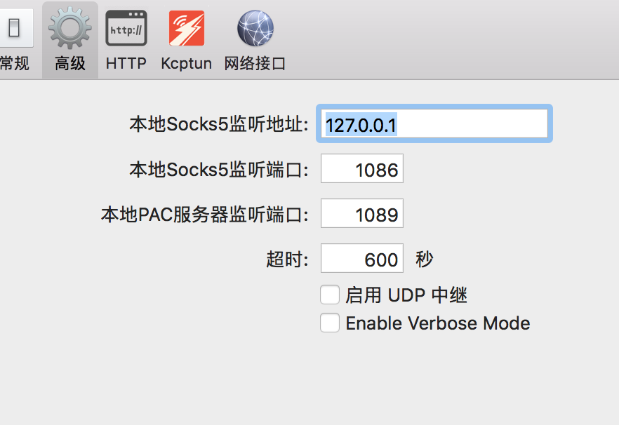
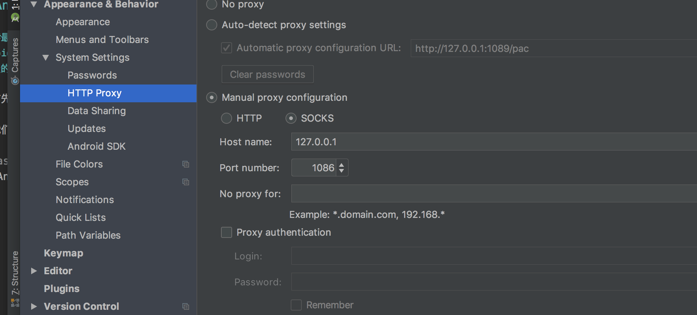
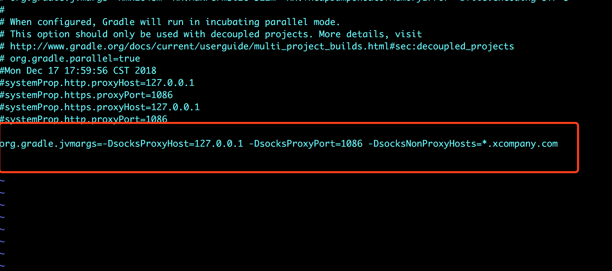

### Android开发入门：
	
##### 最近写毕业论文，想写一个关于android的恶意代码检测的方法，于是 我想先熟悉一下android程序的开发，但是在搭环境的过程中就有很多很多的问题。跑出一个hello world就花了一整天的时间。现在记录一下我在开发过程中遇到的各种问题。

#### 首先就是关于科学上网的相关操作。
   
   我的shadowsocksx-ng：
 
   
   
 
#### 我们需要对 as和gradle分别进行代理配置。
   
as代理配置：
    
`Android Stdio -> Preferences `
 
     
   
gradle代理配置：
   
配置好as代理之后，会 copy as的代理到gradle，但是实际上是没用的。copy as代理之后 gradle配置文件会出现这样的几条代码：
    
    ```
    systemProp.http.proxyHost=127.0.0.1
    systemProp.https.proxyPort=1086
    systemProp.https.proxyHost=127.0.0.1
    systemProp.http.proxyPort=1086
    
    ```
    
但这些对我来说依旧是没用的，我看了接下来的一个文章：
    
[Android Studio Gradle 设置代理 socks5](https://blog.csdn.net/u011562187/article/details/79755567)    
    
然后 我将 gradle.properties 修改成下面：
    

    
然后就可以。
    
解决了翻墙的问题 as就可以愉快的使用了
    
    
    
