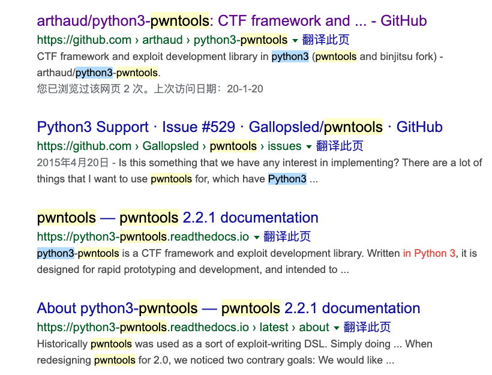
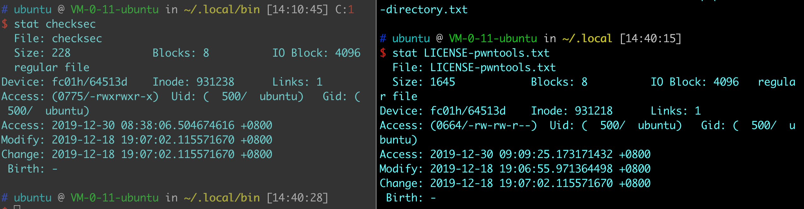

### python3环境下的pwntools安装

看到这个标题肯定会很奇怪，这有什么难的吗？是的，对于我这个什么坑都会遇上的小白来说就是难！好，话不多说，进入正题。

之前已经有文章讲过如果下载python3，如何处理pip与python的关系。文章都是浅显的东西，下次照着做就不会有错。

#### 安装pwntools
之所以要写这个就是因为按照之前 python2的环境下直接`pip install pwntools`下载的pwntools模块是不兼容python3的环境的。

所以一开始我在网上寻找了一个可以在python3环境下使用的pwntools：
[python-pwntools](https://github.com/arthaud/python3-pwntools)但这个安装的pwntools有个问题，就是无法在pwndbg中使用自带的命令，如checksec，会出现一下的错误提示。

```
pwndbg> checksec
Traceback (most recent call last):
  File "/home/ubuntu/pwndbg/pwndbg/commands/__init__.py", line 136, in __call__
    return self.function(*args, **kwargs)
  File "/home/ubuntu/pwndbg/pwndbg/commands/__init__.py", line 216, in _OnlyWithFile
    return function(*a, **kw)
  File "/home/ubuntu/pwndbg/pwndbg/commands/checksec.py", line 16, in checksec
    print(pwndbg.wrappers.checksec.get_raw_out())
  File "/home/ubuntu/pwndbg/pwndbg/commands/__init__.py", line 216, in _OnlyWithFile
    return function(*a, **kw)
  File "/home/ubuntu/pwndbg/pwndbg/wrappers/__init__.py", line 28, in _OnlyWithCommand
    return function(*a, **kw)
  File "/home/ubuntu/pwndbg/pwndbg/memoize.py", line 48, in __call__
    value = self.func(*args, **kwargs)
  File "/home/ubutnu/pwndbg/pwndbg/wrappers/checksec.py", line 31, in get_raw_out
    return pwndbg.wrappers.call_cmd([get_raw_out.cmd_path, "--file", local_path])
  File "/home/ubuntu/pwndbg/pwndbg/wrappers/__init__.py", line 35, in call_cmd
    return subprocess.check_output(cmd, stderr=STDOUT).decode('utf-8')
  File "/usr/lib/python3.5/subprocess.py", line 626, in check_output
    **kwargs).stdout
  File "/usr/lib/python3.5/subprocess.py", line 708, in run
    output=stdout, stderr=stderr)
subprocess.CalledProcessError: Command '['/home/ubuntu/.local/bin/checksec', '--file', '/home/ubuntu/Desktop/pwn2']' returned non-zero exit status 2
```
但是很奇怪的是，如果我不在pwndbg中调用，就是没有问题的：

```
$ checksec pwn2
[*] '/home/ubuntu/Desktop/pwn2'
    Arch:     i386-32-little
    RELRO:    Partial RELRO
    Stack:    No canary found
    NX:       NX enabled
    PIE:      No PIE
```

花了很长时间去想问什么会出现这样的问题，后来直到我在阅读python3-pwntools的readme.md时发现了这样的一句话：

```
Unofficial fork for python 3 of pwntools, the CTF framework and exploit development library. It is designed for rapid prototyping and development, and intended to make exploit writing as simple as possible.
The official pwntools project now supports python 3, starting with pwntools 4.0beta0.
Since this repository is not maintained anymore, we recommend to use the official repository.
```

然后我就去文章中链接的地址重新下载了[pwntools](https://github.com/Gallopsled/pwntools),重新装了一遍之后，问题就解决了。

```
pwndbg> checksec
[*] '/home/liqingyuan/Desktop/pwn2'
    Arch:     i386-32-little
    RELRO:    Partial RELRO
    Stack:    No canary found
    NX:       NX enabled
    PIE:      No PIE (0x8048000)
```
.

之前下载的pwntools是一个4年前就停止维护，在官方推出支持python3后，就不再维护的版本。至于为什么会一开始没有搜索到official的版本完全是google的锅。

通过 python3和pwntools关键字的组合，搜索出的结果是这样的。



前四个结果中，3个结果指向非官方版本。

#### Solution

但是在安装过程中还有一些小问题：

1、在python2环境中，使用pwntools下载的命令是不需要自己配置环境变量就可以使用的，但是在python3环境中需要自己配置。通过使用最常用的checksec命令发现这个问题，在解决这个问题之前我不知道checksec命令是怎么安装到电脑中的。

通过whereis、which、locate命令寻找checksec的在文件夹中的位置。再通过安装路径和文件的创建时间来推测可能是与哪个软件一起安装。



2、知道checksec的安装位置之后，需要添加之环境变量中，不一样的用户，修改环境变量的位置是不一样的，在这里我在~.zshrc中添加环境变量。
并使用`source .zshrc`使之永久有效。

```
export PATH=/usr/local/python/bin:$PATH
```
3、在官网推荐的安装过程并不能顺利安装，让pip下载指定链接中的内容会一直卡在clone的那一步。：

```
$ python -m pip install --upgrade git+https://github.com/Gallopsled/pwntools.git@dev

Collecting git+https://github.com/Gallopsled/pwntools.git@dev
  Cloning https://github.com/Gallopsled/pwntools.git (to revision dev) to /tmp/pip-req-build-dlkiy14l
^COperation cancelled by user
```
所以我选择下载zip文件，解压之后，本地安装。

所以安装过程是这样的：

```
$ cd pwntools-dev
$ sudo pip install --default-timeout=1000 -e .
```
延长时间防止出现连接中断的问题。

基本上这一步就是安装完成，可以与pwndbg一起使用的pwntools，但是我还需要更新一个模块

```
sudo -H pip install --upgrade sortedcontainers
```

不更新的话，会报错提示。

#### conclusion

开发文档还是要阅读的，以后要加强代码的学习。never stop～出现问题，找个网好的地方重新下一遍就能解决一半问题。啊哈哈哈～
