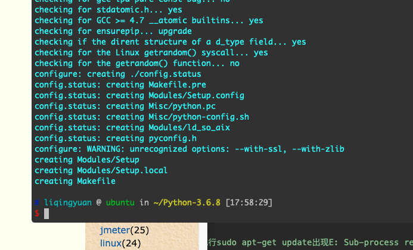
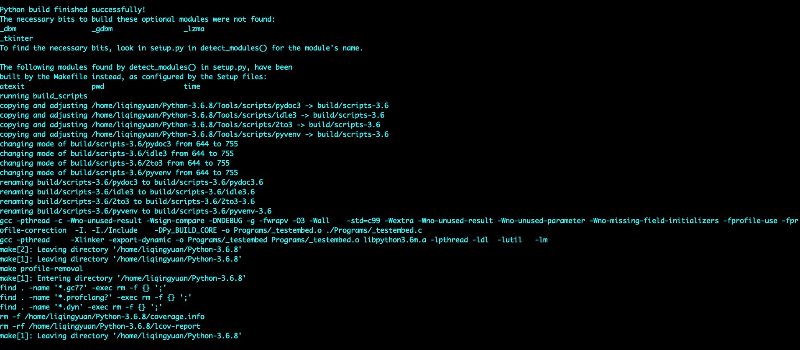
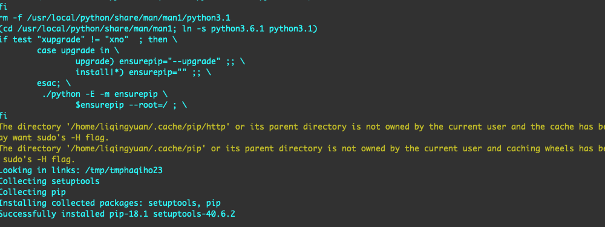

## ubuntu16.04 安装 python3.6.8

python3.6.8在安装之前需要将依赖库都装好，这次安装的过程中出现的问题可能基本都是因为依赖库没有安装完全造成的。因为在我安装好依赖库之后，问题就得到了解决

比如说完成 `sudo ./configure --prefix=/usr/local/python --with-ssl --enable-optimizations`后，出现无效选项：



安装的库如下所示：

```
sudo -s apt-get install libssl-dev libncurses5-dev libsqlite3-dev libreadline-dev libtk8.5 libgdm-dev libdb4o-cil-dev libpcap-dev
```
我参考的网页是这样个：[pip is configured with locations that require TLS/SSL, however the ssl module in Python is not available](https://stackoverflow.com/questions/45954528/pip-is-configured-with-locations-that-require-tls-ssl-however-the-ssl-module-in)

我的情况大概和下面这里的例子相同：
[Python3 ssl模块不可用的问题](https://www.cnblogs.com/minglee/p/9232673.html)

在build完成之后是这样的：



有几个模块没有安装上，但是不碍事，一开始依赖没有安装全的时候，有很多模块没有安装好。

我的安装过程看的是这个网页：[Ubuntu18.04安装Python3.6.8](https://www.cnblogs.com/yjlch1016/p/10359169.html)

`make install`之后 显示是这样的：



至此 安装过程结束。

