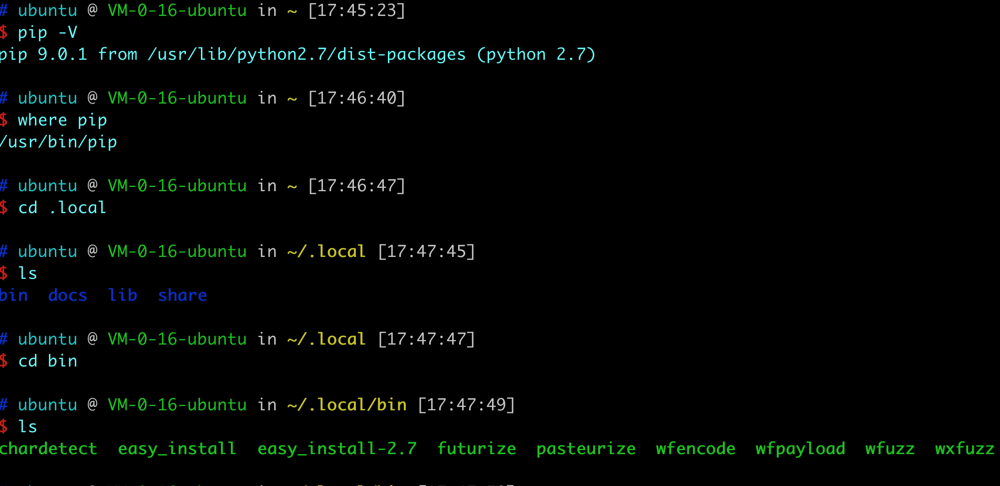
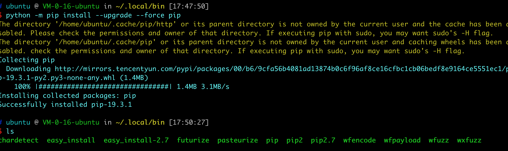
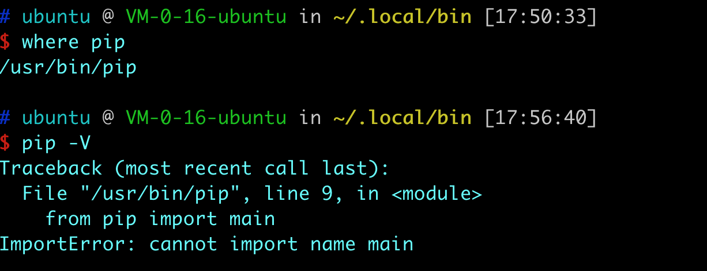
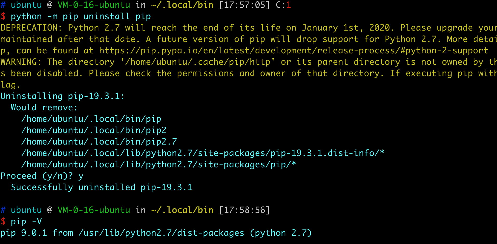

# pip、wfuzz 引发的问题 

#### 昨天在安转wfuzz，参考的文件如下所示：

[WFUZZ大法](https://wh0ale.github.io/2019/03/02/2019-3-2-WFUZZ%E5%A4%A7%E6%B3%95/)

[Wfuzz入门指南](https://www.evi1s.com/archives/152/)

#### 但在我的运行环境（ubuntu18 腾讯云）中只需要 以下两句就可以

```
pip install pycurl
pip install wfuzz
```
并没有把pip升级到最新版本，如果把pip升级到最新版本是有问题的,升级前电脑的pip是这样的：



`~.local\bin`中没有出现pip命令

升级之后 `~.local\bin`中出现pip命令

```
python -m pip install --upgrade --force pip
```



在使用pip命令时会出现以下错误提示：



卸载之后就好了

```
python -m pip uninstall pip
```



但是卸载的路径 emmmm 为啥删了这个就好了呢 很奇怪。

但是不管怎么说自己这个问题如何解决。英语不行真的不行，得好好学英语。

结论就是不需要更新pip 直接下载wfuzz就可以正确安装了。


参考链接：
[知乎 关于系统文件夹](https://www.zhihu.com/question/21265424)

[python环境下，PIP卸载、重装、升级](https://www.cnblogs.com/burz/p/9099281.html)

