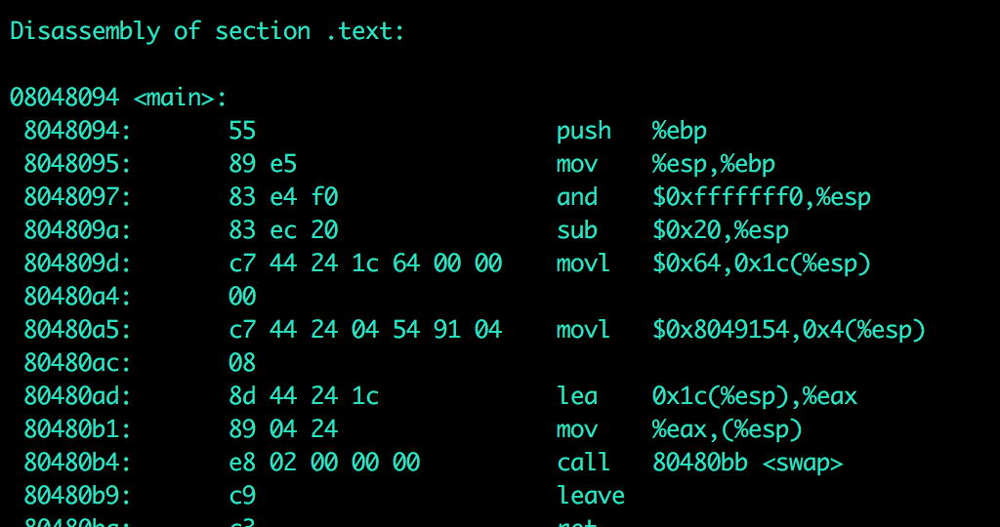
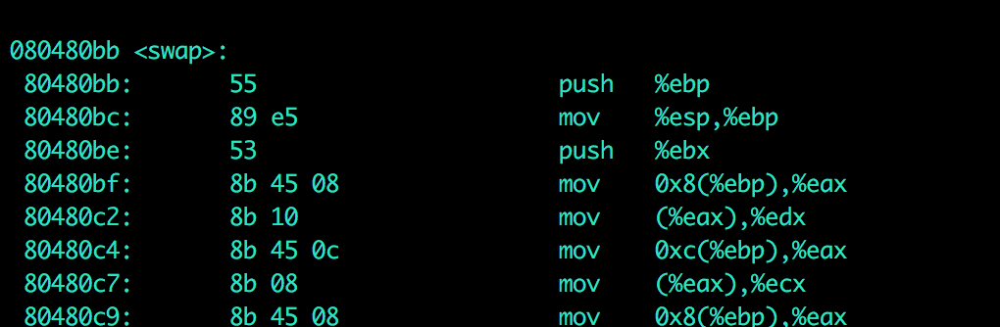

静态链接
--

1、首先要进行相似段的合并

2、空间与地址的分配

3、符号解析与重定位（静态链接的核心内容）

程序例子a.c：
```
extern int shared;
int main()
{
int a=100;
swap(&a,&shared);
}
```

b.c:

```
int shared=1;
void swap(int *a,int *b)
{
*a^=*b^=*a^=*b;

}
```
```
gcc -c a.c
```
生成a.o和b.o

```
objdump -d a.o
```
查看链接前的内容：

<<<<<<< HEAD
=======
如图所示：

偏移地址为15 后面00 00 00 00是shared的地址，但由于没有进行链接 ，所以现在是由0代替

偏移地址为21 ，内容为 fc ff ff ff 为-4  ，-4是调用 距离指令下一条指令的偏移量  ，依旧是偏移量为21的位置，也就是fc ff ff ff 。这是因为没有进行链接，目前还不知道 swap函数的地址。

```
ld a.o b.o -e main -o ab
```
用上面这个指令进行链接
得到文件ab

现在我们再看一下 文件ab：


看到 main的地址变了，shared的地址和swap函数的地址都变了


可以看到 call后面的地址变为 80480bb 就是swap的地址

详解2:

将两个目标文件a.o和b.o的各个段 合并，采用相似段合并的方式。链接器完成这一步（地址和空间分配）之后，就已经可以确定所有符号的虚拟地址了，那么链接器就可以根据符号地址对每个需要重定位的指令进行地址修正。

详解3:

如何知道链接器是如何知道哪些指令需要杯调整？

是因为重定位表的存在
>>>>>>> 2712b8cbbf89671dee5454587f036c030e73d631


