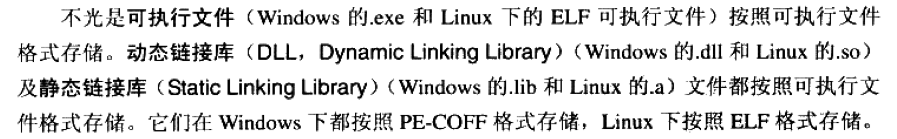
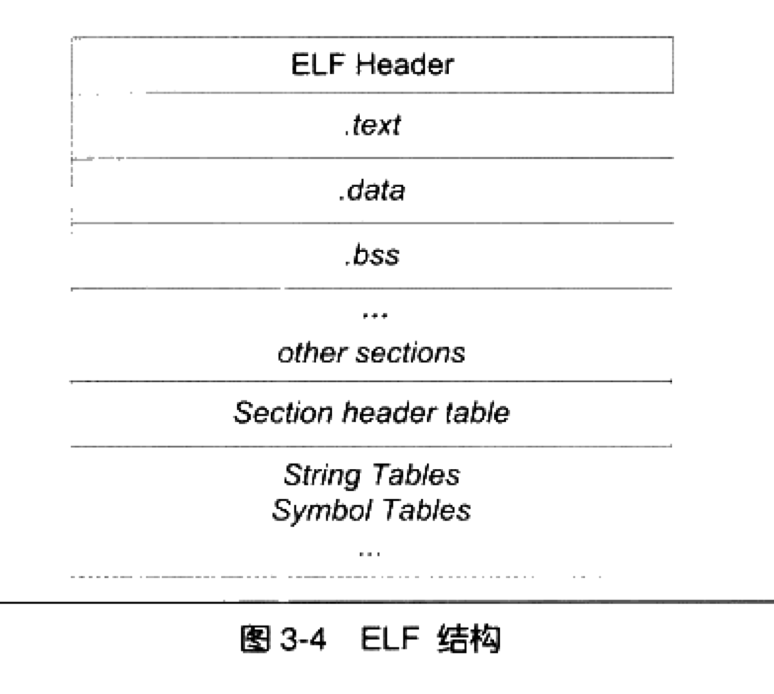
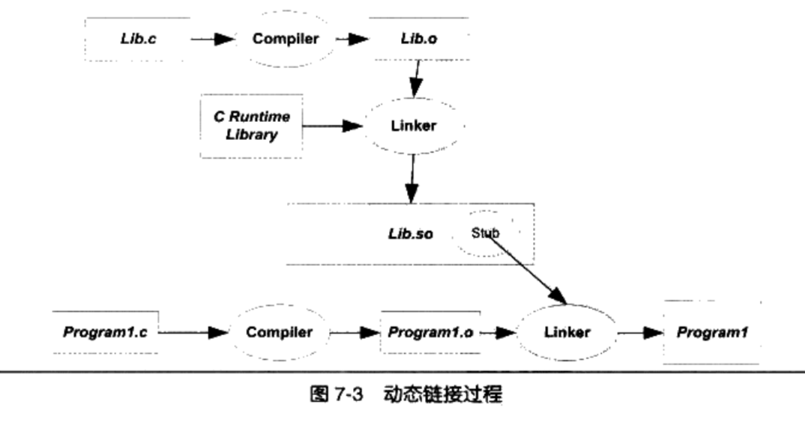
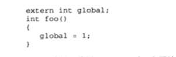
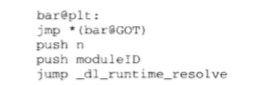

程序猿的自我修养阅读笔记
=========
目标文件
-
编译器编译源代码后生成的文件叫做 `目标文件`。

`目标文件`从结构上讲，它是已经编译后的可执行文件，只是还没有经过链接的过程，其中可能有些符号或有写地址还没有被调整。其实它本身就是按照可执行文件格式存储的，`只是跟真正的可执行文件在结构上稍有不同`。

可执行文件格式（Executable） 主要是windows下的PE(Portable Executable )和linux的elf（excutable linkable format）

`目标文件`就是源代码编译后但`没进行链接`的那些中间文件 .obj /.o

目标文件 中的内容有 编译后的机器指令代码 数据 还有链接时所需要的一些信息，比如 符号表、调试信息、字符串等。
一般目标文件将这些信息按不同的属性，以Section的形式存储，有时候也叫做 Segment

<<<<<<< HEAD
`ELF文件`的开头是一个“文件头”，他描述了整个文件的属性，包括文件是否可执行、是静态连接还是动态连接及入口地址（如果是可执行文件）、目标硬件、目标操作系统等信息，文件头还包括一个（section table）段表，段表其实是一个描述文件各个段的数组。

ELF文件类型

初始化的`全局变量和静态局部变量`存在data段里，未初始化的存在bss段里。`bss`只是为未初始化的全局变量和局部变量预留位置。
.bss段 在 ELF文件中 不存在 但是有大小 存储着 没有初始化的变量？？？ 所以 是存在别的地方了吗？
=======
`ELF文件(可执行文件)`的开头是一个“文件头”，他描述了整个文件的属性，包括文件是否可执行、是静态连接还是动态连接及入口地址（如果是可执行文件）、目标硬件、目标操作系统等信息，文件头还包括一个（section table）段表，段表其实是一个描述文件各个段的数组。

初始化的`全局变量和静态局部变量`存在data段里，未初始化的存在bss段里。`bss`只是为未初始化的全局变量和局部变量预留位置。

ELF可重定位文件

|可重定位文件|可执行文件|共享目标文件|核心转储文件
|---|---|---|---
|Relocatable File|Executable File|Share Object File|Core Dump File
>>>>>>> c96e002ee8810f32df93f0d10057c2874718e40d

ELF目标文件 格式的最前部是ELF文件头（ELF Header）,它包含了描述整个文件的基本属性，比如 ELF文件版本、目标机器型号、程序入口地址等，紧接着 ELF文件各个段 。其中ELF文件中与段有关的重要结构就是段表(Section Header Table)，该表描述了ELF文件所包含的所有段的信息。

ELF文件头结构及相关常数被定义在“／usr／include／elf.h”里

段表的元素 Elf32_Shdr被定义在 “    usr/include/elf.h”里 也叫 段描述符

动态链接的实现
---

进行动态链接的  都是动态链接文件

在linux系统中，ELF 动态链接文件 被称为动态共享对象（DSO，Dynamic Share Objects），简称`共享对象`，他们一般都是以`.os`为扩展名的一些文件；
而在Window系统中，动态链接文件被称为动态链接库（Dynamical Linking Library）`.dll`

程序与libc.os之间真正的链接工作是由动态链接器（就是 ld-2.6.os）完成的。

上图：动态链接的过程

<mark>动态链接下 一个程序分成若干文件 ：
1、程序的主要部分，即可执行文件(program1)
2、程序所依赖的共享对象（lib.so）</mark>

把可执行文件和共享对象 可以看作 是程序的一个模块

`注意：在一个共享对象内 就是一个模块`

如果foobar（）是一个定义在其他静态目标模块（我猜：指的是 不是 共享对象的模块）中的函数，那么链接器将会按照静态连接的规则，将program1.o中的foobar地址引用重定位 ，否则 就是链接器就会将这个符号 的引用标记为一个动态链接的符号，不进行重定位，到装载时再定位。

链接器在解析符号时就可以知道：foobar是一个定义在 lib.os的动态符号。

`上面两段的总结：就是 不是定义在共享文件中的函数 就不会用动态链接的方式。`

`把共享对象模块中的地址引用：
1、模块内部的函数调用

2、模块内部的数据访问，比如 模块中定义的全局变量、静态变量

3、模块外部的函数调用、跳转

4、模块外部的数据访问，比如 其他模块 中定义的全局变量
`

还有一个情况就是：

这种就是 变量global有可能是定义在 共享对象中 也有可能是可执行文件中，这样处理的方式需要注意：
一律按照 动态链接的方式重定位。

延迟绑定

 push n 告诉是哪个函数
 
Push moduleID 告诉是哪个 模块

_dl_runtime_resolve就是 进行解析的程序

