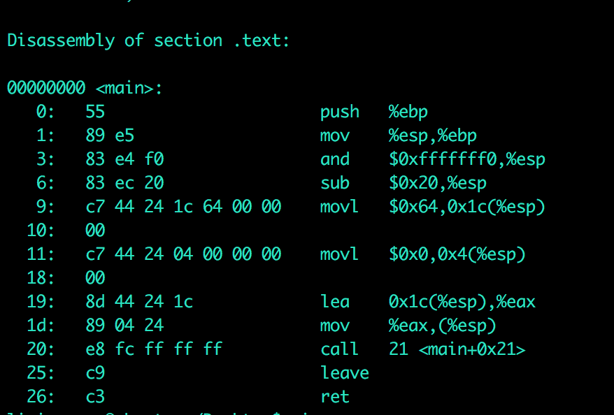

静态链接
--

1、首先要进行相似段的合并

2、空间与地址的分配

3、符号解析与重定位（静态链接的核心内容）

程序例子a.c：
```
extern int shared;
int main()
{
int a=100;
swap(&a,&shared);
}
```

b.c:

```
int shared=1;
void swap(int *a,int *b)
{
*a^=*b^=*a^=*b;

}
```
```
gcc -c a.c
```
生成a.o和b.o

```
objdump -d a.o
```
查看链接前的内容：



