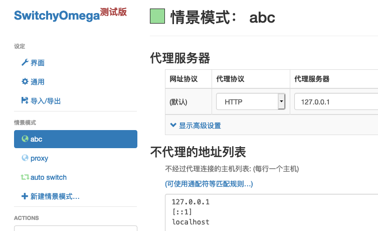
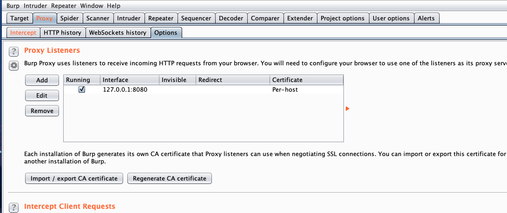
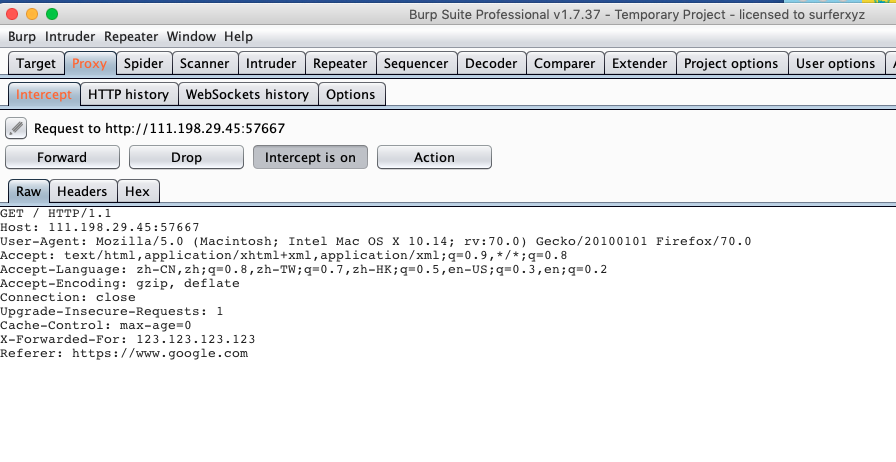
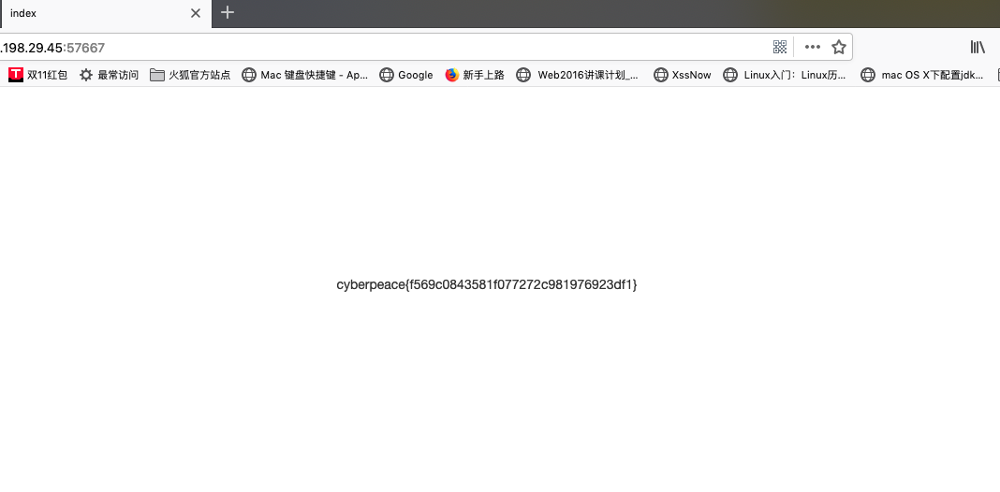

## xff_referer


#### 使用插件SwitchyOmega，更方便切换代理，设置代理如下所示：



#### 在burp suite中设置代理：



#### 在请求包中添加一下信息：

```
X-Forwarded-For: 123.123.123.123
Referer: https://www.google.com
```



#### 释放数据包得到flag：



