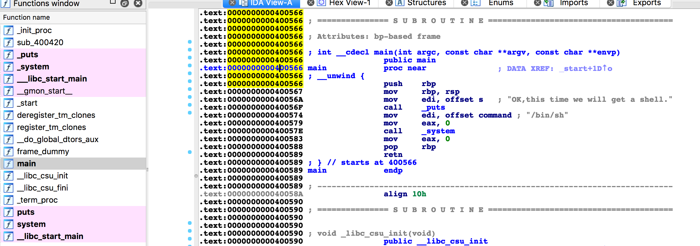
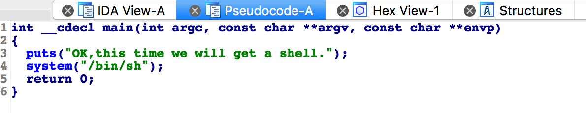
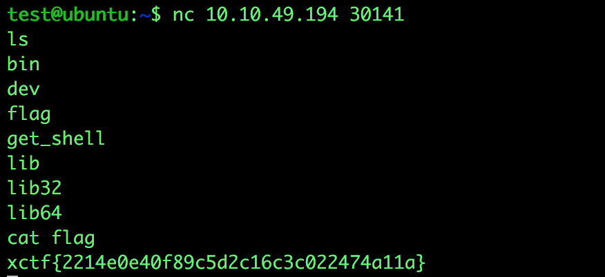

# 攻防世界: get_shell

## **[目标]**
得到shell

## **[Environment]**
Ubuntu

## **[工具]**
ida pro

## **[过程分析]**
`file get_shell`命令查看文件属性，可知 get_shell 是一个64位的文件，将其拖入 ida64 中查看。
 点击左侧 function name 一栏的main函数，右侧可以得到 main 函数的汇编代码。
 

 
 汇编代码不易阅读，我们将光标放置在 main 函数的汇编代码中，按键盘上 f5 可以得到 ida 反汇编得到的伪代码，可以帮助我们更快的理解程序。 

图中`system("/bin/sh")` 的功能为：执行`/bin/sh` shell命令。这样我们就可以获得交互，通过shell命令访问目标主机，读取flag文件，获得flag。

`ls`命令查看当前目录下的文件，发现flag文件，通过`cat`命令读取flag文件的内容，这样我们就可以得到flag。

## **[过程分析]**

欢迎来到pwn的世界，希望大家充满热情并一直坚持下去。

pwn方向的学习需要大量牢固的基础知识，推荐一些基本的读物：

《程序员的自我修养》 《深入理解计算机系统》 《ida pro权威指南》

学习gdb调试，并熟练运用。

大家先阅读一下这两个基础文章：

[手把手教你栈溢出从入门到放弃 上](https://zhuanlan.zhihu.com/p/25816426)

[手把手教你栈溢出从入门到放弃 下](https://zhuanlan.zhihu.com/p/25892385)